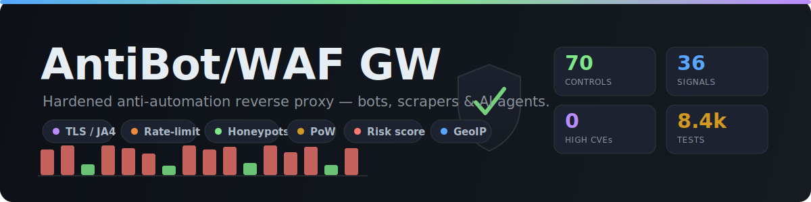

<p align="center">
  
</p>

# AntiBot/WAF GW — Anti-Automation Reverse Proxy

[](https://github.com/tarrinho/AntiBotGW/releases/latest)
[](https://github.com/tarrinho/AntiBotGW/pkgs/container/antibotgw)
[](LICENSE)
[](.github/dependabot.yml)
[](https://github.com/tarrinho/AntiBotGW/pkgs/container/antibotgw)

<!-- Per-control status from the aggregated CI workflow, published to the `badges` branch. -->
[](https://github.com/tarrinho/AntiBotGW/actions/workflows/docker.yml)
[](https://github.com/tarrinho/AntiBotGW/actions/workflows/docker.yml)
[](https://github.com/tarrinho/AntiBotGW/actions/workflows/docker.yml)
[](https://github.com/tarrinho/AntiBotGW/actions/workflows/docker.yml)
[](https://github.com/tarrinho/AntiBotGW/actions/workflows/docker.yml)
[](https://github.com/tarrinho/AntiBotGW/actions/workflows/docker.yml)

A hardened reverse HTTP/WS gateway that sits in front of any web application
and applies **13 layered detection & mitigation controls** against automated
agents (CLI tools, scrapers, headless browsers, AI agents). Domain-agnostic:
the upstream is supplied exclusively via the `UPSTREAM` environment variable.

| Property | Value |
|---|---|
| Image | `appsec-antibot-gw:1.9.11` (amd64 202 MB · arm64 209 MB · armv7 184 MB) |
| Base | Chainguard Wolfi distroless (`cgr.dev/chainguard/python:latest`, pinned by digest); armv7 variant on `python:3.13-alpine` |
| Trivy CVE findings | **0 Critical / 0 High** on all three arches (release-gate posture per rules.md §10) |
| Stack | Python 3.13 · aiohttp 3.14.1 · SQLite WAL (optional TimescaleDB/Postgres mirror) |
| User | non-root, UID 65532 |
| Architecture | linux/amd64, linux/arm64, linux/arm/v7 |
| External intel | Cloudflare Turnstile · AbuseIPDB · CrowdSec · MaxMind GeoLite2 (ASN + City) |
| In-process detectors | 36 weighted signals · 13 hot-toggleable kill-switches · risk-score model with NAT-aware threshold + Anubis-mode strict PoW |
| Operator dashboards | `/antibot-appsec-gateway/secured/{dashboard, agents, service, controls, geo, logs, settings}` (DB-backed, click-to-drill) |

## Architecture (1.9.11)

```
                                ┌─────────────────────┐
   client ──── HTTP(S) ────────▶│  AntiBot/WAF GW           │
                                │  ───────────────────│
                                │  middleware chain:  │
                                │   1. cost_meter     │  ← per-request wall-time
                                │   2. session cookie │
                                │   3. protect():     │
                                │      L0  TLS / JA4 fingerprint deny-list
                                │      L0.4 custom rules engine (allow/block/challenge/tag)
                                │      L1  rate-limit: socket-IP + per-identity tokens
                                │      L1.5 host-not-allowed gate (multi-vhost)
                                │      L2  honeypot paths (silent decoy)
                                │      L2.5 suspicious-path / SQLi / XSS / LFI / path traversal
                                │      L2.6 path-sweep (1.7.3 — content-discovery post-challenge)
                                │      L2.7 GraphQL introspection / batch / depth (1.8.5)
                                │      L3  AI probe + AI-headers + AI-enumeration
                                │      L3.2 browser-automation probe (1.7.1 — webdriver / CDP)
                                │      L3.4 LLM no-subresource heuristic (1.7.3)
                                │      L3.5 UA filter (empty / curl / GPTBot / mismatch)
                                │      L3.6 sec-fetch-nav-absent signal (1.8.14)
                                │      L3.7 header completeness, accept:*/*, Origin (eTLD+1 1.8.14)
                                │      L4  bot-trap form fields, body-pattern match
                                │      L4.2 honey-cred semantic injection (1.7.3 P1)
                                │      L4.5 canary echo (R7 — token planted in HTML)
                                │      L4.7 redirect-maze trap (1.8.x)
                                │      L5  behavioural (no-static-fetch / churn / 404 burst)
                                │      L5.2 cookie-lifecycle (1.7.2 — `agw_lc` HMAC 1.8.14)
                                │      L5.4 referer-chain (1.7.2 — ghost / loop signals)
                                │      L5.6 impossible-travel (1.7.2 — geo / time-velocity)
                                │      L5.7 client-side interaction probe (1.8.6 — entropy)
                                │      L5.8 canvas / WebGL fp enrichment (1.7.2)
                                │      L6  external intel: AbuseIPDB · CrowdSec · MaxMind ASN
                                │      L7  cookie gate: JS_CHALLENGE / Turnstile / Anubis-mode PoW
                                │      L8  risk-score model (decay + NAT threshold + soft-tier)
                                │      ↓
                                │      decision = deny | challenged | soft-challenge | allow
                                │   4. forward to UPSTREAM if allowed
                                │   5. record() → SQLite (events, timeline, clients, bans)
                                │      └─ timeline[bucket]["challenged"] incremented at issue
                                └─────────────┬───────┘
                                              │
                          ┌───────────────────┼─────────────────────┐
                          ▼                   ▼                     ▼
                  ┌──────────────┐  ┌──────────────────┐   ┌─────────────────┐
                  │   /data      │  │  Redis (opt'l)   │   │  External APIs  │
                  │   antibot.db │  │  shared bans /   │   │ AbuseIPDB v2    │
                  │   (SQLite    │  │  canary tokens   │   │ CrowdSec LAPI   │
                  │   WAL)       │  │  for fleet mode  │   │ Turnstile sv    │
                  │   .pow_key   │  └──────────────────┘   │ MaxMind .mmdb   │
                  │   .session_… │                         │ (offline)       │
                  │   .admin_key │                         └─────────────────┘
                  │   GeoLite2-* │
                  │   vhosts.json│  ← per-vhost config overrides (1.8.0)
                  └──────────────┘

  operator browser ──▶  /antibot-appsec-gateway/secured/control-center   ─┐
                        /antibot-appsec-gateway/secured/center-control     │  12 dashboards;
                        /antibot-appsec-gateway/secured/live-feed          │  hot-tunable knobs
                        /antibot-appsec-gateway/secured/agents             │  via /secured/config;
                        /antibot-appsec-gateway/secured/service            │  click reasons →
                        /antibot-appsec-gateway/secured/controls           │  drill-down;
                        /antibot-appsec-gateway/secured/geo                │  threshold sliders
                        /antibot-appsec-gateway/secured/logs               │  rewire risk model
                        /antibot-appsec-gateway/secured/settings           │  live.
                        /antibot-appsec-gateway/secured/siem               │  (1.8.4)
                        /antibot-appsec-gateway/secured/honeypots          │  (1.8.12)
                        /antibot-appsec-gateway/secured/vhost-policy  ─────┘
```

The gateway is a single Python process. Persistent state (event log,
client snapshots, timeline, bans, admin-IP allowlist) lives in
`/data/antibot.db` (SQLite WAL); rotation keys live in `/data/.{pow,session,admin}_key`.
External integrations are best-effort: any one of them (AbuseIPDB,
CrowdSec, MaxMind ASN, MaxMind City, Turnstile, Anubis-mode PoW, Redis)
may be absent and the gate degrades gracefully — the in-process
detectors are sufficient on their own.

### Cookie-gate decision tree (Layer 7)

`JS_CHALLENGE=1` engages the cookie gate.  How a fresh client gets a
chal cookie depends on which extras are configured:

```
                    request without chal cookie
                              │
                ┌─────────────┼─────────────┐
                ▼             ▼             ▼
          path is in    path ends in     everything else
       JS_CHAL_OPEN_     static-asset
            PATHS         suffix
            │                 │              │
            │                 │              ▼
            │                 │       ┌──────────────┐
            │                 │       │ TURNSTILE_   │
            │                 │       │ ENABLED &&   │
            │                 │       │ identity     │
            │                 │       │ risk ≥       │
            │                 │       │ TURNSTILE_   │
            │                 │       │ RISK_THRESH  │
            │                 │       └──┬───────────┘
            │                 │          │ yes
            │                 │          ▼
            │                 │       Turnstile widget HTML
            │                 │       → siteverify
            │                 │       → mint chal cookie
            │                 │
            │                 │       no  ─▶  ANUBIS_ENABLED?
            │                 │                  │ yes
            │                 │                  ▼
            │                 │              PoW page (boosted
            │                 │              difficulty) → mint
            │                 │                  │ no
            │                 │                  ▼
            │                 │              HTML GET + Accept:
            │                 │              text/html?
            │                 │                  │ yes ─▶ heuristic auto-mint
            │                 │                  │ no  ─▶ silent decoy
            ▼                 ▼
      bypass cookie     bypass cookie
      gate (still       gate (still
      runs UA / risk    runs UA / risk
      detectors)        detectors)
```

The strictest configuration is **Turnstile + Anubis-mode + JS_CHAL_OPEN_PATHS = []**.  The most permissive is **JS_CHALLENGE=0** (gate disabled, downstream detectors only).

### MaxMind self-maintenance chain

In 1.5.5 the gateway maintains its own GeoLite2 mmdbs end-to-end:

```
docker build → COPY _seed/*.mmdb → /usr/local/share/maxmind/   (image-baked)
                          │
                          ▼
container start →  _maxmind_seed_from_image()  ──▶ if /data empty → copy
                          │
                          ▼
                  _maxmind_auto_fetch()
                  needs MAXMIND_LICENSE_KEY?
                          │ yes
                          ▼
                  https://download.maxmind.com → /data/GeoLite2-{ASN,City}.mmdb
                          │
                          ▼
                  _maxmind_refresh_loop() — every 24h, re-fetch if mmdb >30d old
                          │
                          └─── operator pushes "Fix now" on /secured/geo  ─┐
                                                                        ▼
                                                       POST /secured/maxmind-fetch
                                                                     │
                                                       runs seed + auto_fetch then
                                                       reopens reader handles
```

The image always ships seed mmdbs so a brand-new deploy works offline; `MAXMIND_LICENSE_KEY` enables fresh downloads + monthly self-refresh; the `/secured/maxmind-fetch` endpoint and the GeoMap "Fix now" button are operator-on-demand triggers.

### Risk-score lifecycle

Every detector that fires writes a weighted contribution into the per-identity `risk_score`.  The score then drives a three-tier decision model:

```
detectors fire ─▶ risk_score += RISK_WEIGHTS[reason]
                            │
                            ├─ score < SOFT_CHALLENGE_SCORE        ─▶ green (allowed)
                            │
                            ├─ SOFT ≤ score < BAN                  ─▶ orange "missed"
                            │     ├─ allowed but counted on the timeline
                            │     ├─ open-path bypass REVOKED — chal-required
                            │     └─ Turnstile widget shown if score ≥
                            │       TURNSTILE_RISK_THRESHOLD (default = mid-orange)
                            │
                            └─ score ≥ BAN  ─▶ red (banned-silent)
                                  │
                                  ├─ AI-flagged reasons → 24h hostile pool
                                  │   (HOSTILE_BAN_SECS, default 86400)
                                  │
                                  └─ Other reasons → standard ban duration
                                      (RISK_BAN_DURATION_SECS)

                  (continuously decayed)
                  score *= 0.5 every RISK_DECAY_HALFLIFE_SECS (1h)
                  per-reason contributions decay in lockstep so the
                  /secured/agents popover always shows the live breakdown.

NAT awareness:  if ≥ NAT_IDENTITIES_THRESHOLD (default 3) "legitimate-
looking" identities (≥1 static fetch AND ≥3 allowed reqs) are seen on
the same IP within 1h, the BAN threshold doubles (50 → 100) so a
shared-NAT office isn't carpet-banned by one bad apple.
```

The thresholds (`SOFT_CHALLENGE_SCORE`, `RISK_BAN_THRESHOLD`, `RISK_BAN_THRESHOLD_NAT`, `RISK_DECAY_HALFLIFE_SECS`, `HOSTILE_BAN_SECS`, `TURNSTILE_RISK_THRESHOLD`) are all hot-reloadable via `/secured/config` and live-tunable on `/secured/live-feed` (defense-thresholds slider) and `/secured/controls`.

---

## Quick start

```bash
docker network create --driver bridge antibot-net 2>/dev/null
docker volume  create antibot-data 2>/dev/null

KEY="$(openssl rand -base64 24 | tr '+/' '-_' | tr -d '=')"
MYIP="$(curl -s https://api.ipify.org)"

docker run -d --name appsec-antibot-gw1.9.11 \
  --restart unless-stopped --init \
  --read-only --tmpfs /tmp:size=8m,mode=1777,nosuid,nodev,noexec \
  --cap-drop ALL \
  --security-opt no-new-privileges:true \
  --security-opt apparmor=docker-default \
  --pids-limit 200 --memory 256m --memory-swap 256m --cpus 1.0 \
  --ulimit nofile=4096:4096 --ulimit nproc=200:200 --ulimit core=0:0 \
  --ipc=private --network antibot-net \
  --log-opt max-size=10m --log-opt max-file=3 \
  -p 8443:8443 \
  -e UPSTREAM="https://your-internal-app.example.com" \
  -e ALLOWED_HOSTS="www.example.com" \
  -e ADMIN_ALLOWED_IPS="$MYIP,127.0.0.1" \
  -e ADMIN_KEY="$KEY" \
  -e TRUST_XFF=last \
  -v antibot-data:/data \
  appsec-antibot-gw:1.9.11 \
&& echo "ADMIN_KEY: $KEY"
```

Put TLS in front (`nginx`, `cloudflared`, `caddy` …). The proxy itself
listens HTTP-only on `:8443`.

---

## Docker Compose deployment (recommended)

The bundled `docker-compose.yml` launches a **full four-service stack** and is the
recommended way to run AntiBot/WAF GW in production.

### What it starts

| Service | Image | Role | Host port |
|---|---|---|---|
| `appsec-antibot-gw` | `appsec-antibot-gw:1.9.11` | The gateway itself — proxies traffic, runs all detectors, serves operator dashboards | **8443** (only port exposed to host) |
| `appsec-timescaledb` | `timescale/timescaledb:latest-pg16` | Postgres 16 + TimescaleDB — optional persistent event store; switch from SQLite in one click via `/secured/controls` | none (internal only) |
| `appsecgw-redis` | `redis:7-alpine` | Shared ban store for fleet-mode (multi-replica) deployments; also backs canary token propagation | none (internal only) |
| `crowdsec` | `crowdsecurity/crowdsec:latest` | CrowdSec LAPI — subscribes to the community blocklist; gateway uses it as an external intel source | none (internal only) |

Only the gateway exposes a port to the host. TimescaleDB, Redis, and CrowdSec are
reachable only from the internal Docker network `antibot-net`, and each enforces
authentication within that network as defence-in-depth.

### Network topology

```
Internet / reverse-proxy
        │
        ▼  :8443
┌───────────────────────────────────────────────────────┐
│  Docker network: antibot-net                          │
│                                                       │
│  ┌─────────────────────┐                              │
│  │  appsec-antibot-gw  │                              │
│  │  (gateway)          │─────── Redis ban sync ──────▶│appsecgw-redis│
│  │                     │─── CrowdSec blocklist ──────▶│crowdsec      │
│  │                     │─── Postgres events ─────────▶│appsec-       │
│  │                     │    (when DB_BACKEND=postgres) │timescaledb   │
│  └─────────────────────┘                              │              │
│           │                                           └──────────────┘
│           ▼ UPSTREAM (env var)
│    your application
└───────────────────────────────────────────────────────┘
```

### Pre-requisites

```bash
# Create the shared network and persistent volumes once
docker network create --driver bridge antibot-net
docker volume create antibot-data
docker volume create appsec-timescaledb-data
docker volume create crowdsec-data
docker volume create crowdsec-conf
```

### Configuration

```bash
cp .env.example .env
```

Minimum required fields in `.env`:

| Variable | Example | Notes |
|---|---|---|
| `UPSTREAM` | `https://app.internal.example.com` | Target application — all non-admin traffic is forwarded here |
| `ADMIN_ALLOWED_IPS` | `203.0.113.10/32,127.0.0.1/32` | CIDR list of IPs allowed to reach admin dashboards |
| `TRUSTED_PROXIES` | `172.16.0.0/12` | IPs whose `X-Forwarded-For` the gateway trusts |
| `POSTGRES_PASSWORD` | *(strong random)* | TimescaleDB password — used by gateway DSN automatically |
| `REDIS_PASSWORD` | *(strong random)* | Redis `requirepass` value — used by gateway `REDIS_URL` automatically |

Optional but recommended:

| Variable | Purpose |
|---|---|
| `ADMIN_KEY` | Static Bearer token for admin API. Auto-generated on first boot if unset, but setting it explicitly makes key rotation predictable. |
| `TURNSTILE_SITEKEY` / `TURNSTILE_SECRET` | Enable Cloudflare Turnstile for real-browser gating |
| `ABUSEIPDB_KEY` | Enable AbuseIPDB IP-reputation lookups |
| `MAXMIND_LICENSE_KEY` | Enable weekly MaxMind GeoLite2 auto-refresh |

### Launch

```bash
docker compose up -d
```

This starts all four services with `unless-stopped` restart policy. The gateway
**waits for TimescaleDB and Redis to pass their healthchecks** before starting
(`depends_on: condition: service_healthy`), so there is no race on first boot.

Monitor startup:

```bash
docker compose logs -f appsec-antibot-gw
# Expect: "[js-challenge] active" and "AntiBotWaf_GW_1.9.11 listening …" within 5 s
```

Check that all services are healthy:

```bash
docker compose ps
# All four services should show "healthy" or "running" (CrowdSec starts with "service_started")
```

### Post-up: register the CrowdSec bouncer

CrowdSec generates the bouncer API key at runtime. After the stack is up, run
these commands once:

```bash
BKEY=$(docker exec crowdsec cscli bouncers add appsecgw -o raw)
echo "CROWDSEC_LAPI_KEY=$BKEY" >> .env
echo "CROWDSEC_LAPI_URL=http://crowdsec:8080" >> .env
docker compose up -d --force-recreate appsec-antibot-gw
```

Without this step the gateway starts without CrowdSec intel (the integration is
gracefully skipped) and logs a warning at startup.

### Access the operator dashboards

All dashboards require the gateway to be reachable and the `X-Admin-Key` header
to match the configured key.

| Dashboard | URL | Description |
|---|---|---|
| Main | `http://host:8443/antibot-appsec-gateway/secured/dashboard` | Live counters, block-reason breakdown, event log |
| Controls | `http://host:8443/antibot-appsec-gateway/secured/controls` | Hot-toggle all knobs, tune thresholds, switch DB backend |
| Agents | `http://host:8443/antibot-appsec-gateway/secured/agents` | Stealth agent hunter — identities that passed every block |
| GeoMap | `http://host:8443/antibot-appsec-gateway/secured/geo` | MaxMind-backed geographic request distribution |
| Logs | `http://host:8443/antibot-appsec-gateway/secured/logs` | Structured event log with drill-down |

### Switching between SQLite and Postgres

The gateway ships with SQLite as the default backend (zero-deps, works on first
boot). Switch to TimescaleDB at any time without migration — events accumulate
fresh in the new backend:

1. Open `/antibot-appsec-gateway/secured/controls` → Backend pill toggle → click **postgres**.
2. The gateway restarts itself within ~2 s.
3. Confirm: `docker compose logs appsec-antibot-gw | grep "db_backend=postgres"`.

Switch back to SQLite the same way.

#### Frequent: "the database system is not yet accepting connections"

After an **unclean Postgres restart** (power loss, OOM-kill, host reboot,
`docker restart`), or simply when the gateway and the DB start together on
`docker compose up`, you will see a burst of log lines like:

```
appsec-timescaledb | FATAL:  the database system is not yet accepting connections
appsec-timescaledb | DETAIL:  Consistent recovery state has not been yet reached.
```

**This is normal and self-healing — not a fault.** Postgres is up but still
**replaying its write-ahead log (WAL crash recovery)** and rejects every client
(the gateway, CrowdSec, etc.) until redo completes. It typically clears in
seconds; large/busy databases can take a minute or two.

What the gateway does about it (1.9.3+): it recognises this state (SQLSTATE
`57P03`) and logs a **calm** line instead of a stack trace —
`[db-pg] Postgres is still starting (crash/WAL recovery in progress) … retrying`.
At boot it retries for **~60 s** (12 attempts, linear backoff) to ride out the
recovery, so in the common case it simply connects once redo finishes. If
recovery outlasts that budget the gateway **exits and Docker restarts it**, and
it retries again — it keeps cycling until Postgres is ready (this preserves the
PG-only contract; it does **not** silently run on an empty SQLite). At runtime
(DB restarts after boot) the background recovery probe reconnects automatically.

**Do NOT `docker restart` the database while it is recovering** — interrupting
WAL replay is how a one-minute blip becomes real corruption. Just wait, then:

```bash
docker exec appsec-timescaledb pg_isready     # "accepting connections" = recovered
docker logs --tail 50 appsec-timescaledb      # look for "database system is ready to accept connections"
```

It is only genuinely stuck if recovery never finishes — usual causes: **disk
full** (`df -h`), a **missing/corrupt WAL segment**, or an **OOM crash-loop**
(`dmesg | grep -i 'oom\|killed process'`).

### Scaling to multiple replicas (fleet mode)

Add `REDIS_URL` to `.env` (defaults to the bundled sidecar). All replicas share
the same Redis instance — bans and canary tokens propagate within ~5 s across
the fleet. Each replica needs its own `ADMIN_KEY` or the same shared one pinned
in `.env`.

### Tear down

```bash
docker compose down          # stop + remove containers; volumes are preserved
docker compose down -v       # stop + remove containers AND volumes (destroys event data)
```

---

## Threat model & honest posture

Earlier iterations of this gateway shipped an in-process "JS challenge" that stacked client-computed primitives — SHA-256 Proof-of-Work, browser-API probe with cross-validation, anchor-fetch proof, sub-second timing windows — to try to distinguish real browsers from scripted clients. Empirically every one of those layers was bypassable in pure Python in ~1 s. They were *bot-cost amplifiers*, not security boundaries; they have been removed.

The gateway is now fully usable without any third-party service (1.4.4). Turnstile is one of two cookie-minting modes; the other is a heuristic auto-mint that runs entirely in-process. The honest posture differs by mode:

What remains:
- **Layered heuristics** — UA filter, header-completeness scoring, behavioral timing, rate limits (per-identity + per-socket-IP), risk-score model, bot-trap forms, body-pattern matching, slowloris guard, suspicious-path patterns, AI-probe path detection, honey-link injection. These are still cost amplifiers, but they're light-weight and they don't claim to be a hard wall.
- **Cookie-bound access (V8) + Turnstile minter** — opt-in via `JS_CHALLENGE=1` *and* `TURNSTILE_SITEKEY`/`TURNSTILE_SECRET`. The chal cookie is bound to (UA + IP-tier + opaque-hashed JA4 when present). The minter accepts only a Cloudflare Turnstile success token, which is generated server-side by Cloudflare and verified against `siteverify`; nothing the attacker computes locally satisfies it. Without Turnstile keys configured, this feature is disabled and a startup banner says so.
- **JA4 telemetry** — the per-request log records the TLS handshake fingerprint observed by a trusted upstream (`JA4_HEADER`, default `CF-JA4`), so operators can drive `JA4_DENY_LIST` from real traffic rather than heuristic guesses.

The cookie is therefore **also bound to the JA4 TLS fingerprint** when one is observed (V9.2). JA4 is the one signal in the stack the client *doesn't compute* — the network observes it during the TLS handshake. A cookie issued under one handshake cannot be replayed under another, so an attacker switching TLS stacks (e.g. Python urllib → curl → Chrome impersonate) loses every cookie they just paid PoW for. To use JA4 binding the gateway must sit behind a JA4-injecting front (cloudflared injects `CF-JA4`; nginx with the JA4 module also works); operator pins the trusted source via `JA4_TRUSTED_PEERS`.

For the strongest defense, **enable Cloudflare Turnstile** — `TURNSTILE_SITEKEY` + `TURNSTILE_SECRET`. The success token is minted by Cloudflare server-side and verified against `siteverify`; nothing the attacker computes locally satisfies it.

| Threat | Heuristics only (no Turnstile) | With Turnstile |
|---|---|---|
| Bare-UA `curl`/short UA | Blocked (UA filter) | Blocked |
| Empty `Accept-*` / no `Sec-Fetch-*` | Blocked (header completeness) | Blocked |
| Honey-pot path probe | Risk-score → ban + silent decoy | Same |
| Bot-trap form fill | Risk-score → ban | Same |
| Suspicious POST body (SQLi/XSS/SSTI) | Body-pattern match → silent decoy | Same |
| Single-host scripted bypass on API | Not blocked — gate is OFF | **Blocked** — Turnstile token required to mint cookie |
| Cookie replay across handshakes | n/a | Blocked (cookie bound to UA + IP-tier + JA4 hash) |

## What it does

Every incoming request passes through 14 primary detection buckets (numbered
0-13 below). Any non-PoW block returns **the upstream homepage as `200 OK`**
(silent decoy) so an attacker cannot enumerate which layer fired.

The Architecture ASCII above shows the full expanded chain (~30 sub-checks at
1.9.10, e.g. `L2.5` suspicious-path, `L2.7` GraphQL, `L3.4` LLM-no-subresource,
`L4.5` canary-echo, `L5.7` interaction-entropy). Each sub-check rolls up into
one of these 14 buckets — the ASCII is the mechanism view, this table is the
capability view.

| # | Layer bucket | Sub-checks (subset) | What it catches |
|---|---|---|---|
| 0 | Path / method / host gating | L0, L0.4, L1.5 | Control bytes, disallowed methods, mismatched Host, admin-IP allowlist, custom-rules-engine allow/block/challenge/tag |
| 1 | Identity ban | (L1) | Previously-banned identity → silent decoy |
| 2 | Honeypot paths | L2 | `/wp-admin`, `/.env`, `/.git/config`, IMDS, `/actuator/*`, … |
| 3 | Suspicious-path patterns | L2.5, L2.6, L2.7 | CTF flag-hunting, traversal, SQLi/XSS markers, content-discovery post-challenge, GraphQL introspection/depth |
| 4 | UA filter | L3.5 | Empty / too-short / blocklisted (60+ entries: HTTP libs, scanners, AI agents, headless browsers) |
| 5 | AI-probe paths | L3, L3.2, L3.4 | OpenAPI / Swagger / `llms.txt` / model discovery; webdriver/CDP; LLM no-subresource heuristic |
| 6 | Header completeness | L3.6, L3.7 | Browser UA without `Sec-Ch-Ua` / `Sec-Fetch-*`; sec-fetch-nav absent; Origin eTLD+1 mismatch |
| 7 | Path-discipline | L5 | Enumeration (>300 unique paths), HTML loads with no asset fetches |
| 8 | Socket-IP rate limit | L1 (socket bucket) | Token bucket on kernel-observed peer IP (un-spoofable) |
| 9 | Per-identity rate limit | L1 (identity bucket) | Token bucket on identity hash; static-asset GETs exempt |
| 10 | Behavioural timing | L5, L5.2, L5.4, L5.6, L5.7, L5.8 | σ/μ < 0.05, cookie-lifecycle HMAC, referer-chain ghost/loop, impossible-travel, interaction-entropy, canvas/WebGL fp |
| 11 | Proof-of-Work | L7 | Bound to `METHOD:path`, replay-protected; opt-in per path; Anubis-mode boost |
| 12 | Risk-score model | L8 | Weighted scoring, NAT-aware threshold, external intel (AbuseIPDB · CrowdSec · MaxMind ASN) |
| 13 | Honey-link injection | L4, L4.2, L4.5, L4.7 | Hidden links before `</body>`, bot-trap forms, honey-cred injection, canary-echo, redirect-maze trap |

Plus protocol-level support:

- **WebSocket bridging** — full bidirectional bridge with sub-protocol negotiation
- **SSO redirect rewriting** — `Location`, embedded `redirect_uri`, `Set-Cookie` `Domain=`
- **Origin / Referer / Host rewriting** to upstream's canonical origin
- **Streaming body forwarding** with hard size caps
- **Edge-injected security response headers** on HTML (XFO, nosniff, HSTS, COOP, CORP, Permissions-Policy with explicit Privacy-Sandbox opt-out, …)

### External integrations (1.5.4)

| Integration | Purpose | Effective weight |
|---|---|---|
| Cloudflare Turnstile | Real-browser challenge minted by `siteverify`. Shown only when identity's risk ≥ `TURNSTILE_RISK_THRESHOLD` | gates the chal cookie |
| AbuseIPDB | Crowdsourced IP reputation, 6h SQLite cache | `+50` (high) / `+15` (med) |
| CrowdSec LAPI | Self-hosted community blocklist, 60s cache | `+70` (instant ban) |
| MaxMind GeoLite2-ASN | Local ASN tagging — hosting-provider IPs | `+5` (soft) |
| MaxMind GeoLite2-City | Lat/lng for the GeoMap dashboard | telemetry only |
| Anubis-mode (PoW) | In-process strict PoW gate — raises difficulty by `ANUBIS_DIFFICULTY_BOOST` | gates failing-PoW requests |
| Redis (optional) | Cross-instance shared bans / canary tokens for fleet mode | shared state |

---

## Screenshots

### Control Center — `/secured/control-center`
Post-login landing page: Vhost Traffic Summary, active ban overview, gateway health stats, and 6 analytics charts (Traffic Pipeline, Bot Score Distribution, Vhost Block Rate Heatmap, Signal Performance Matrix, Geo Top Countries, Threat Category Donut).


### Stealth Agent Hunter — `/secured/agents`
Identities that passed every block but exhibit stealth signals. Per-identity stealth score 0–100 with component bars, plus the detection-vs-miss timeline.


## Operator dashboards

Login at `/antibot-appsec-gateway/login` — session cookie (`agw_session`) required for all `/secured/` endpoints. Reachable from any IP in `ADMIN_ALLOWED_IPS`.

| URL (all under `/antibot-appsec-gateway/`) | Purpose |
|---|---|
| `live` | Unauthenticated liveness probe (returns `ok`) |
| `login` | Multi-user login form (POST → `agw_session` cookie) |
| `secured/control-center` | **Control Center** — post-login landing; Vhost Traffic Summary; 6 analytics charts (Traffic Pipeline · Score Distribution · Vhost Heatmap · Signal Performance · Geo Countries · Threat Donut) |
| `secured/live-feed` | **Live Feed** — real-time traffic timeline, defense-threshold sliders, cost-per-request graph, services panel, per-detector hits, click-reason drill-down |
| `secured/agents` | **Stealth Agent Hunter** — click identity for IP/UA/session/JA4/timing popover; click risk score for per-signal breakdown |
| `secured/service` | **Service Metrics** — CPU / memory / disk / network / SQLite with 30-day windowed history (in-memory + SQLite fallback) |
| `secured/controls` | **Controls** — all hot-reload knobs (toggles, thresholds, lists); Defenses & scoring merged table; Anubis toggle; admin-IP allowlist |
| `secured/geo` | **Geo map** — Leaflet world-map (green=clean / orange=missed / red=blocked); animated 24-bucket time scrubber; Tor/DC overlay toggles |
| `secured/logs` | **Structured logs** — filterable event log with category pills + CSV export |
| `secured/settings` | **Settings** — config export/import (ZIP XML), user management, session ledger, Storage card (vacuum), GW Registry |
| `secured/vhost-policy` | **Vhost Policy** — per-vhost knob override inspector |
| `secured/metrics` | JSON feed: `clients`, `top_paths`, `timeline`, `by_reason`, `detector_hits`, `jschal_*`, `services` |
| `secured/agents-data` | Per-identity stealth-score JSON (`risk_breakdown`, `blocks_breakdown`) |
| `secured/agents-timeline` | Detected-vs-missed timeline JSON |
| `secured/detector-stats` | p50/p99 per signal + per-method-bucket aggregation + chal-cookie mint rate |
| `secured/score-distribution` | 8-bin histogram of active client risk scores (1.8.2) |
| `secured/traffic-pipeline` | Allowed / challenged / blocked / bypassed timeline (SQLite fallback, 1.8.2) |
| `secured/vhost-heatmap` | Block-rate cells per vhost × time-bucket sparse matrix (1.8.2) |
| `secured/signal-performance` | Per-detector hits / blocks / p50/p95/p99 latency (1.8.2) |
| `secured/security-incidents` | Recent high-severity events bucketed by severity tier, enriched with live risk score (1.8.3) |
| `secured/risk-percentiles` | P5/P25/P50/P75/P95/P99 ribbon time-series + 21-bin histogram + KPI trend (1.8.3) |
| `secured/ban-events` | IP ban / session ban / bypass / challenge event timeline + CAPTCHA funnel solve-rate (1.8.3) |
| `secured/top-attackers` | Enriched attacker leaderboard: ASN/org, country flag, AbuseIPDB score, JA4, 24 h sparkline, quick actions (1.8.3) |
| `secured/config` | Read or update hot-reload knobs (GET/POST JSON) |
| `secured/admin-ips` | Admin IP allowlist CRUD (GET/POST/PATCH/DELETE) |
| `secured/rotate-keys` | Rotate `SESSION_KEY` and/or `POW_HMAC_KEY` |
| `secured/vhosts` | Virtual-host CRUD (GET/POST/DELETE) |
| `secured/ban` / `secured/unban` | Manually ban or unban an identity / IP |
| `secured/geo-data` · `secured/geo-drill` | Aggregated lat/lng points; per-cell IP drill-down modal |
| `secured/logs-data` · `secured/logs-export` | Structured event log JSON + CSV export |
| `secured/health-score` | Per-pillar gateway health (disk / memory / db / integrations / bans / block_rate) |
| `secured/vhost-stats` · `secured/vhost-breakdown` | Per-vhost counters and traffic stacked-area data |
| `secured/block-reasons-timeline` · `secured/top-attacked-paths` | Block-reason time series + top-10 paths |

---

## Configuration (env vars)

### Required

| Variable | Description |
|---|---|
| `UPSTREAM` | Fully-qualified URL of the backend to protect. Container fails fast if missing. |

### Frequently used

| Variable | Default | Description |
|---|---|---|
| `ALLOWED_HOSTS` | _(empty)_ | Comma-separated public hostnames the gateway accepts as Host header |
| `ADMIN_ALLOWED_IPS` | _(empty)_ | Comma-separated IPs/CIDRs allowed on `/antibot-appsec-gateway/secured/*` |
| `ADMIN_KEY` | auto-generated | Always mirrored to `/data/.admin_key` |
| `TRUST_XFF` | `first` | `first` / `last` / `none` — see XFF section below |
| `TRUSTED_PROXIES` | _(empty)_ | **Set in production.** CIDRs of upstream proxies allowed to set XFF (1.5.4) |
| `JS_CHALLENGE` | `0` | Cookie gate on every non-static path (Turnstile-backed when configured) |
| `JS_CHAL_OPEN_PATHS` | _(empty)_ | Path prefixes that bypass the cookie gate (SPA data layer / webhooks / S2S) |
| `SOFT_CHALLENGE_SCORE` | `4` | Risk-score threshold (orange band start) — hot-reloadable via `/secured/config` |
| `RISK_BAN_THRESHOLD` | `50` | Risk-score threshold (red band / ban) — hot-reloadable |
| `TURNSTILE_RISK_THRESHOLD` | `0` (auto = mid-orange) | Show Turnstile only when identity's risk crosses this. Below it, fresh clients fall through to cookie auto-mint — most users never see Turnstile, only suspected bots do (1.5.4) |
| `POSTGRES_DSN` | _(empty)_ | When set, gateway runs in **PG-only mode** (single-DB contract — SQLite at `$DB_PATH` is preserved but unused). Boot guard fails fast (`SystemExit 2/3/4`) if PG unreachable. See MANUAL §18 "Postgres / single-DB mode" for the full guide + `db.import`/`db.export` CLI tools. (1.9.0) |
| `POSTGRES_BOOT_MAX_ATTEMPTS` / `POSTGRES_BOOT_BACKOFF_S` | `30` / `1.0` | Boot-guard retry budget when `POSTGRES_DSN` is set (1.9.0) |
| `OFFLINE_BG_TASKS` | `0` | Set to `1` to skip every outbound-HTTPS refresh loop (MaxMind / Tor / CrowdSec / feeds / mesh). Used by the test suite. (1.9.0) |

### Rate limiting

| Variable | Default |
|---|---|
| `BURST` / `REFILL` | `30` / `3.0` (per-identity) |
| `IP_BURST` / `IP_REFILL` | `60` / `5.0` (socket-IP) |

See **MANUAL.md §4 — Rate limiting** for the token-bucket mechanics,
two-bucket-per-visitor design, `Retry-After` formula, tuning playbook,
and per-vhost override examples.

### Method allowlist

| Variable | Default |
|---|---|
| `ALLOWED_METHODS` | `GET,HEAD,POST,OPTIONS` |

Add `PUT,PATCH,DELETE` for REST APIs.

### Proof-of-Work

| Variable | Default |
|---|---|
| `POW_REQUIRED_PATHS` | _(empty)_ |
| `POW_REQUIRE_ALL_WRITES` | `0` |
| `ANUBIS_ENABLED` | `0` |
| `ANUBIS_DIFFICULTY_BOOST` | `1` |

PoW is **opt-in**. Set `POW_REQUIRED_PATHS=/login,/admin` to require PoW on
those paths only.

**Anubis-mode** (`ANUBIS_ENABLED=1`, hot-reloadable): forces the PoW gate on
*every* first-time request without a valid `chal` cookie, even when
`JS_CHALLENGE=0`. `ANUBIS_DIFFICULTY_BOOST` (0..6) adds extra leading hex
zeros to the SHA-256 challenge — each +1 makes scripted solving ~16× harder
(default `+1` → 6 leading zeros instead of 5). Inspired by
[github.com/TecharoHQ/anubis](https://github.com/TecharoHQ/anubis); useful
when the protected app is being actively scraped by LLM-driven agents.

### Trusted reverse-proxy / XFF spoofing protection (1.5.4)

| Variable | Default |
|---|---|
| `TRUST_XFF` | `first` |
| `TRUSTED_PROXIES` | _(empty — every peer trusted, back-compat)_ |

**Production deployments MUST set `TRUSTED_PROXIES`** to the IP / CIDR list of
the reverse-proxy or CDN immediately upstream (e.g. `TRUSTED_PROXIES=172.17.0.1/32,103.21.244.0/22,...`
for cloudflared / nginx). When set, `X-Forwarded-For` is honoured **only** if
the kernel-observed peer IP falls inside one of those CIDRs; everything else
falls back to the raw socket IP. Closes a pentest finding from 1.5.3 where
a client hitting the gateway directly could spoof XFF and impersonate any
source IP for ban-tracking and admin-allowlist purposes.

### Geo-map (1.5.4)

| Variable | Default |
|---|---|
| `MAXMIND_CITY_DB_PATH` | `/data/GeoLite2-City.mmdb` |

Drop a `GeoLite2-City.mmdb` (~65 MB) into the named volume to populate the
`/secured/geo` (GeoMap) dashboard. The bundled `maxmind-refresh.sh` cron script
downloads both `GeoLite2-ASN.mmdb` and `GeoLite2-City.mmdb` monthly using
`MAXMIND_LICENSE_KEY`. Map tiles are served from CARTO Dark Matter (no key,
no Referer requirement).

### External integrations

| Variable | Purpose |
|---|---|
| `ABUSEIPDB_KEY` | AbuseIPDB v2 API key — high-score IPs hit `+50` risk |
| `CROWDSEC_LAPI_URL` | URL of self-hosted CrowdSec LAPI (e.g. `http://crowdsec:8080`) |
| `CROWDSEC_LAPI_KEY` *or* `CROWDSEC_API_KEY` | CrowdSec bouncer API key — either name accepted (1.5.4) |
| `MAXMIND_ASN_DB_PATH` | Path to GeoLite2-ASN.mmdb (default `/data/GeoLite2-ASN.mmdb`) |
| `MAXMIND_CITY_DB_PATH` | Path to GeoLite2-City.mmdb (1.5.4) |
| `TURNSTILE_SITEKEY` / `TURNSTILE_SECRET` | Cloudflare Turnstile widget keys |
| `OIDC_ISSUER` | *(optional)* Keycloak realm base URL — enables SSO login (1.8.5) |
| `OIDC_CLIENT_ID` | Keycloak confidential client ID |
| `OIDC_CLIENT_SECRET` | Keycloak client secret (Settings → Credentials in Keycloak) |
| `OIDC_DEFAULT_ROLE` | Role assigned to auto-provisioned OIDC users (`viewer` / `maintainer` / `admin`, default `viewer`) |
| `OIDC_SCOPES` | Space-separated OIDC scopes (default `openid profile email`) |

Each integration is best-effort — any one of them may be absent and the
gate degrades gracefully. Live status / cost / telemetry visible at
`/secured/external` (or click any card on the Controls dashboard for full
vendor docs + trigger criteria + data-egress info, 1.5.4).

### Hot-reloadable knobs (POST `/secured/config`)

All listed values can be changed at runtime without restart. The
`/secured/controls` dashboard exposes them as toggles / inputs / sliders / lists.

**Toggles (booleans):**
`JS_CHALLENGE`, `BOT_TRAP_FORMS`, `BODY_PATTERN_MATCH`, `CANARY_ECHO_DETECTION`,
`STRICT_ORIGIN`, `INJECT_SECURITY_HEADERS`, `JS_CHAL_BIND_JA4`,
`JS_CHAL_REQUIRE_JA4`, `JS_CHAL_STRICT_STATIC`, `ABUSEIPDB_ENABLED`,
`CROWDSEC_ENABLED`, `MAXMIND_ENABLED`, `TURNSTILE_ENABLED`,
`HONEYPOT_ENABLED`, `SUSPICIOUS_PATH_ENABLED`, `AI_PROBE_ENABLED`,
`UA_FILTER_ENABLED`, `UA_PLATFORM_CHECK_ENABLED`, `HEADER_COMPLETENESS_ENABLED`,
`BEHAVIORAL_CHECK_ENABLED`, `AI_ENUMERATION_ENABLED`, `AI_NO_ASSETS_ENABLED`,
`SESSION_FLOOD_ENABLED`, `UPSTREAM_404_TRACKING_ENABLED`, `ANUBIS_ENABLED`.

**Numeric thresholds:**
`RISK_BAN_THRESHOLD`, `SOFT_CHALLENGE_SCORE`, `TURNSTILE_RISK_THRESHOLD`,
`ANUBIS_DIFFICULTY_BOOST`, `RATE_LIMIT_BURST`, `RATE_LIMIT_REFILL`,
`IP_BURST`, `IP_REFILL`, `HOSTILE_BAN_SECS`, `CANARY_TTL_S`,
`GLOBAL_RPS_LIMIT`, `SESSION_CHURN_WINDOW_S`, `SESSION_CHURN_MAX`,
`JA4_AUTODENY_THRESHOLD`.

**Lists:** `JS_CHAL_OPEN_PATHS`, `JA4_DENY_LIST`.

**Logging:** `LOG_LEVEL` (`debug` / `info` / `warn` / `error`).

### Security response headers

| Variable | Default |
|---|---|
| `INJECT_SECURITY_HEADERS` | `1` |
| `SEC_X_FRAME_OPTIONS` | `SAMEORIGIN` |
| `SEC_X_CONTENT_TYPE_OPTIONS` | `nosniff` |
| `SEC_REFERRER_POLICY` | `strict-origin-when-cross-origin` |
| `SEC_HSTS` | `max-age=31536000; includeSubDomains` |
| `SEC_PERMISSIONS_POLICY` | minimal whitelist |
| `SEC_COOP` | `same-origin` |
| `SEC_CORP` | `same-site` |
| `SEC_X_PERMITTED_XDP` | `none` |
| `SEC_CSP` | _(empty)_ |

### Resource caps

| Variable | Default |
|---|---|
| `UPSTREAM_MAX_BODY` | `2 MiB` |
| `UPSTREAM_MAX_RESP` | `8 MiB` |
| `MAX_IDENTITIES` | `100000` |
| `ENUM_THRESHOLD` | `300` (unique paths/identity before enum block) |

### Service-metrics sampling

| Variable | Default | Description |
|---|---|---|
| `SVC_METRICS_INTERVAL` | `5` | Seconds between samples on the service dashboard. |
| `SVC_METRICS_RETENTION` | `8640` | Number of samples kept in memory (8640 × 5 s = 12 h). |

Each sample includes: CPU %, load average (1/5/15), memory total/used/available, swap, cgroup memory, disk total/used/available for `/data`, process count, open FDs, network rx/tx bps, and SQLite file sizes (db + WAL + SHM). Dashboard supports `prev / now / fwd` navigation, window selector (5 min – 12 h), bucket selector (5 s – 1 h).

### v1.4.2/3 header-based controls (all opt-in)

| Variable | Default | Description |
|---|---|---|
| `JA4_HEADER` | `CF-JA4` | Name of the header carrying the TLS fingerprint (cloudflared injects `CF-JA4` since 2024.x) |
| `JA4_DENY_LIST` | _(empty)_ | Comma-separated TLS fingerprints to block (e.g. `t13d_curl_8x,t13d_python_requests`) |
| `JA4_TRUSTED_PEERS` | _(empty)_ | Comma-separated IPs/CIDRs allowed to inject the JA4 header (the TLS terminator). Empty = trust all (assumes firewall blocks direct port access). |
| `STRICT_ORIGIN` | `0` | When `1`, POST/PUT/PATCH/DELETE requires `Origin` header host to match `ALLOWED_HOSTS` |
| `PRESERVE_HOST` | `0` | When `1`, forward the client's original `Host`, `Origin`, and `Referer` headers to upstream unchanged (skips the proxy's netloc rewrite). Enable only when upstream routes by the public hostname. Default `0` rewrites headers to the upstream's netloc for correct TLS SNI and CORS. Per-vhost configurable. |
| `OPEN_ORIGIN_PATHS` | _(empty)_ | Path prefixes that bypass the Origin check (e.g. `/api/webhook`) |
| `REQUIRED_HEADERS` | _(empty)_ | Comma-separated header names that must be present on every non-admin, non-static request |

### v1.4 controls (all opt-in / safe defaults)

| Variable | Default | Description |
|---|---|---|
| `JS_CHALLENGE` | `0` | Cookie gate. With `=1`, every non-static, non-admin, non-opted-out request must carry a valid `chal` cookie. Two minting modes: (a) **Turnstile mode** when `TURNSTILE_SITEKEY` + `TURNSTILE_SECRET` are configured — Cloudflare's `siteverify` is the boundary, only widget-solved tokens validate. (b) **Heuristic mode** when no Turnstile keys — cookie is auto-issued on the first qualifying HTML GET (one that passes UA filter, header completeness, behavioural, body-pattern, canary-echo, etc.). Heuristic mode adds ~1 RTT of cost to scripted clients and forces them through every other layer; not a hard wall, but works without any third-party dependency. Cookieless API/XHR/POST hits are always silent-decoyed in either mode. |
| `JS_CHALLENGE_TTL` | `3600` | Cookie lifetime in seconds. |
| `JS_CHAL_OPEN_PATHS` | _(empty)_ | Comma-separated path prefixes that bypass the cookie gate. Use for legit non-browser clients (S2S, mobile apps, webhooks, e.g. `/webhook/,/s2s/`). |
| `JS_CHAL_STRICT_STATIC` | `1` | When ON, the static-asset bypass refuses paths containing API hints (`/api/`, `/graphql`, `/v1/`, ...). Closes `/api/v1/users.css` style probes against permissive backends. |
| `TURNSTILE_SITEKEY` | _(empty)_ | Cloudflare Turnstile public site key. Required to enable the gate. |
| `TURNSTILE_SECRET` | _(empty)_ | Cloudflare Turnstile secret. Used by `/antibot-appsec-gateway/challenge` to call `siteverify`. |
| `JS_CHAL_BIND_JA4` | `1` | Bind the chal cookie to the JA4 fingerprint (opaque hash, never the raw value) when one is injected by a trusted peer. Cookie replay across TLS stacks fails. Opportunistic — clients with no JA4 still work. |
| `JS_CHAL_REQUIRE_JA4` | `0` | Hard requirement: `/antibot-appsec-gateway/challenge` rejects (`403`) any submission without a JA4 from a trusted peer. Use only behind a JA4-injecting terminator (cloudflared / nginx-JA4). |
| `CANARY_ECHO_DETECTION` | `1` | **R7 (1.4.3)** — plant unique `agw-c-<16hex>` tokens in every HTML response (HTML comment + `X-Trace-Id` header). Any subsequent request from any identity that quotes one of those tokens back is silent-decoyed and ban-pooled. Targets LLM agents that summarise the page into the model's context and re-emit fragments in the next prompt. Near-zero false-positive on browser traffic. |
| `CANARY_TTL_S` | `600` | How long an issued canary stays valid for echo detection (sliding window). |
| `HOSTILE_BAN_SECS` | `86400` | **R8 (1.4.3)** — duration to keep AI-agent-flagged identities (canary-echo, honeypot, suspicious-path, ai-probe) silent-decoyed. Generic bans still use the shorter `RISK_BAN_DURATION_SECS`. |
| `BODY_PATTERN_MATCH` | `0` | Extends the suspicious-path regex set to POST/PUT/PATCH bodies (SQLi/XSS/SSTI/cmd-injection markers in form/JSON/XML). |
| `BOT_TRAP_FORMS` | `0` | Auto-injects a hidden `<input>` into every `<form>` in HTML responses; flags POSTs that fill it. |
| `HEADERS_TIMEOUT` | `10` | Slowloris: max seconds to receive full request headers. |
| `BODY_TIMEOUT` | `30` | Slowloris: max seconds to receive full request body. |

### Session cookie

| Variable | Default |
|---|---|
| `SESSION_SAMESITE` | `Lax` |
| `SESSION_SECURE` | `1` |

### SSO / Keycloak *(optional — 1.8.5)*

Password login is always available. SSO is a zero-configuration drop-in: set the three env vars below and a **"Sign in with Keycloak"** button appears on the login page. Operators without Keycloak continue using username + password exactly as before.

**Keycloak setup (5 minutes):**

1. Create a new **confidential** client in your realm (Clients → Create client).
2. Under **Settings**, set:
   - Access type: `Confidential`
   - Valid redirect URIs: `https://your-gateway-host/antibot-appsec-gateway/auth/oidc/callback`
3. Copy the **Client secret** from the Credentials tab.

**Gateway env vars:**

```env
OIDC_ISSUER=https://keycloak.example.com/realms/your-realm
OIDC_CLIENT_ID=appsecgw
OIDC_CLIENT_SECRET=<paste client secret>
OIDC_DEFAULT_ROLE=viewer          # optional — role for new users (default: viewer)
```

**How it works:**

- The gateway redirects the browser to Keycloak → user authenticates → Keycloak redirects back with a short-lived authorization code.
- The gateway exchanges the code for an access token at Keycloak's token endpoint, then fetches the user's `preferred_username` from `/protocol/openid-connect/userinfo`.
- On first login the user is **auto-provisioned** in the local users table with `OIDC_DEFAULT_ROLE`. On subsequent logins the existing account (and its role) is reused — an admin can promote the user to `maintainer` or `admin` via Settings → Users.
- The session cookie issued after SSO login is identical to a password-login cookie — same 12 h TTL, same revocation mechanics, same audit log entry.
- OIDC users have no local password; the password form rejects them (the stored hash is empty).

**No new dependencies** — the token exchange and userinfo call use `aiohttp`, which is already a runtime dependency.

| Variable | Default | Description |
|---|---|---|
| `OIDC_ISSUER` | _(empty)_ | Keycloak realm URL. OIDC is disabled when unset. |
| `OIDC_CLIENT_ID` | _(empty)_ | Keycloak client ID. |
| `OIDC_CLIENT_SECRET` | _(empty)_ | Keycloak client secret. |
| `OIDC_DEFAULT_ROLE` | `viewer` | Role assigned to new users on first OIDC login. |
| `OIDC_SCOPES` | `openid profile email` | OIDC scopes requested at the authorization endpoint. |

### Debug

| Variable | Default |
|---|---|
| `DEBUG` | `0` (set `1` to expose `/secured/xff`) |

---

## Container hardening

| Control | Value |
|---|---|
| Filesystem | `--read-only` rootfs + `--tmpfs /tmp:size=8m,nosuid,nodev,noexec` |
| Capabilities | `--cap-drop ALL` |
| Privilege escalation | `--security-opt no-new-privileges:true` |
| MAC | `--security-opt apparmor=docker-default` |
| PID 1 | `--init` (tini) |
| IPC | `--ipc=private` |
| Network | dedicated user-defined bridge (`--network antibot-net`) |
| Resources | `--memory 256m --memory-swap 256m --cpus 1.0 --pids-limit 200` |
| Ulimits | `nofile=4096 nproc=200 core=0` |
| Logs | `--log-opt max-size=10m --log-opt max-file=3` |
| User | non-root UID 65532 |
| CVEs (Trivy) | **0 Critical / 0 High** (all three arches) |

---

## Multi-site fleet — one gateway per challenge / app

Designed so each protected site gets its own gateway *container*, while the
fleet shares state through one Redis. A flag on challenge **A** is silent-
decoyed on challenges **B…N** within seconds (read-through cache) and at
the TLS-handshake layer within 30 s (JA4 deny-list refresh). One operator
webhook rings once per ban, not N times.

### Topology

```
                    Internet
                       │
            ┌──────────┴──────────┐
            │  TLS terminator     │   nginx / Cloudflared / Caddy / ALB
            │  (host or per-app)  │   ← injects CF-JA4 if available
            └──────┬──────┬───────┘
                   │      │
                   ▼      ▼
         ┌──────────┐  ┌──────────┐  ┌──────────┐
         │ gw-app1  │  │ gw-app2  │  │ gw-appN  │  ← one container/site
         │ :8443    │  │ :8443    │  │ :8443    │
         └────┬─────┘  └────┬─────┘  └────┬─────┘
              │             │             │
              └────┬────────┴────┬────────┘
                   │             │
                   ▼             ▼
              ┌─────────┐   ┌──────────┐
              │  Redis  │   │ Webhook  │   ← Slack / Discord / SIEM
              │ (bans + │   │ receiver │
              │  JA4    │   └──────────┘
              │  shared)│
              └─────────┘
```

Each gateway forwards to **one** upstream (`UPSTREAM=https://app1.internal`),
isolates its own SQLite + chal-cookie HMAC, and writes ban events through
to the shared Redis. No gateway sees another's traffic — only its bans.

### Step 1 — start the shared Redis (once)

```bash
docker network create antibot-net 2>/dev/null
docker run -d --name antibot-redis --network antibot-net \
  --restart unless-stopped \
  -v antibot-redis-data:/data \
  redis:7-alpine redis-server --appendonly yes
```

### Step 2 — spin up one gateway per site

A small helper makes the per-site flags trivial. Save as `spawn-gw.sh`:

```bash
#!/usr/bin/env bash
# Usage: ./spawn-gw.sh <site-name> <upstream-url> <listen-port>
set -euo pipefail

NAME="$1"            # e.g. ctf-pwn1
UPSTREAM="$2"        # e.g. https://pwn1.internal:8000
PORT="${3:-8443}"
ADMIN_KEY="${ADMIN_KEY:-$(openssl rand -base64 24 | tr '+/' '-_' | tr -d '=')}"
WEBHOOK_URL="${WEBHOOK_URL:-}"   # optional; same value on every container
WEBHOOK_SECRET="${WEBHOOK_SECRET:-}"
TURNSTILE_SITEKEY="${TURNSTILE_SITEKEY:-}"
TURNSTILE_SECRET="${TURNSTILE_SECRET:-}"

docker rm -f "appsec-gw-${NAME}" 2>/dev/null || true
docker run -d --name "appsec-gw-${NAME}" \
  --restart unless-stopped --init --network antibot-net \
  --read-only --tmpfs /tmp:size=8m,mode=1777,nosuid,nodev,noexec \
  --cap-drop ALL --security-opt no-new-privileges:true \
  --pids-limit 200 --memory 256m --memory-swap 256m --cpus 1.0 \
  --ulimit nofile=4096:4096 --ulimit nproc=200:200 --ulimit core=0:0 \
  --ipc=private --log-opt max-size=10m --log-opt max-file=3 \
  -p "${PORT}:8443" \
  -e UPSTREAM="${UPSTREAM}" \
  -e ALLOWED_HOSTS="${NAME}.example.com,127.0.0.1" \
  -e ADMIN_ALLOWED_IPS="${ADMIN_ALLOWED_IPS:-127.0.0.1}" \
  -e ADMIN_KEY="${ADMIN_KEY}" \
  -e TRUST_XFF=last \
  -e JS_CHALLENGE=1 \
  -e CANARY_ECHO_DETECTION=1 \
  -e BOT_TRAP_FORMS=1 \
  -e BODY_PATTERN_MATCH=1 \
  -e LOG_FORMAT=json \
  -e LOG_LEVEL=info \
  -e REDIS_URL="redis://antibot-redis:6379/0" \
  -e REDIS_NS="appsecgw-${NAME}-shared" \
  -e WEBHOOK_URL="${WEBHOOK_URL}" \
  -e WEBHOOK_SECRET="${WEBHOOK_SECRET}" \
  -e TURNSTILE_SITEKEY="${TURNSTILE_SITEKEY}" \
  -e TURNSTILE_SECRET="${TURNSTILE_SECRET}" \
  -v "appsec-gw-${NAME}-data:/data" \
  appsec-antibot-gw:1.9.11
echo "  → ${NAME}: http://localhost:${PORT}    admin key: ${ADMIN_KEY}"
```

Then:

```bash
ADMIN_KEY=$(openssl rand -base64 24 | tr '+/' '-_' | tr -d '=') \
WEBHOOK_URL=https://hooks.slack.com/services/T0/B0/X0 \
WEBHOOK_SECRET=$(openssl rand -hex 32) \
./spawn-gw.sh ctf-pwn1   https://pwn1.internal:8000   9001
./spawn-gw.sh ctf-web2   https://web2.internal:8000   9002
./spawn-gw.sh staff-app  https://staff.internal:8443  9003
```

Each gateway is independent for traffic; they share one ban list, one JA4
deny-list, one webhook channel.

### What's shared (1 Redis) vs. per-instance

| Across the fleet (Redis) | Per gateway (local SQLite + memory) |
|---|---|
| `appsecgw:ban:<track-key>` — sticky bans (24 h hostile-pool reasons) | events log (last 200 in dashboard, all in `/data/antibot.db`) |
| `appsecgw:ja4-bans:<ja4>` counter — drives auto-deny | per-identity rate-limit token buckets |
| `appsecgw:ja4-denylist` set — refreshed on each instance every 30 s | risk score, behavioural windowing, header-completeness scores |
| `appsecgw:wh:<reason>:<key>` — webhook dedup (5 min TTL) | service-metrics samples (CPU/mem/disk/proc/FDs) |
| `REDIS_NS` knob — namespace per environment (`prod`, `staging`, `ctf-2026`) | chal cookie HMAC (rotate via `/secured/rotate-keys` per instance, or fleet-wide via the loop below) |

`REDIS_NS` decides whether two clusters share or isolate state. Same value
across N instances → fleet-wide shared bans. Different values (`gw-prod`
vs `gw-staging`) → fully isolated.

### Operating the fleet

> **Note (v1.6.7+)**: Bearer-key auth (`?key=`) was removed. All `/secured/` endpoints require an `agw_session` cookie. Authenticate once per gateway before running the loops below:
> ```bash
> for port in 9001 9002 9003; do
>   curl -s -c /tmp/gw-${port}.cookie \
>     -X POST "http://localhost:${port}/antibot-appsec-gateway/login" \
>     -d "username=admin&password=${ADMIN_PASSWORD}"
> done
> ```

**Hot-reload one knob across every gateway** (controls dashboard works
per instance; for fleet-wide changes use a small loop):

```bash
APPLY='{"BODY_PATTERN_MATCH": true, "RISK_BAN_THRESHOLD": 60}'
for port in 9001 9002 9003; do
  curl -s -b /tmp/gw-${port}.cookie \
    -X POST "http://localhost:${port}/antibot-appsec-gateway/secured/config" \
    -H 'Content-Type: application/json' -d "$APPLY"
done
```

**Bump the throughput cap on every site simultaneously:**

```bash
for port in 9001 9002 9003; do
  curl -s -b /tmp/gw-${port}.cookie \
    -X POST "http://localhost:${port}/antibot-appsec-gateway/secured/config" \
    -H 'Content-Type: application/json' -d '{"GLOBAL_RPS_LIMIT": 50}'
done
```

**Rotate the HMAC key on every gateway after a credential incident:**

```bash
for port in 9001 9002 9003; do
  curl -s -b /tmp/gw-${port}.cookie \
    -X POST "http://localhost:${port}/antibot-appsec-gateway/secured/rotate-keys?scope=all"
done
# every chal/session cookie issued before this point fails on every gateway
```

**Ban an identity everywhere** (the local ban write also pushes through
Redis, so any gateway in the namespace will start silent-decoying):

```bash
curl -b /tmp/gw-9001.cookie \
  "http://localhost:9001/antibot-appsec-gateway/secured/ban?id=<track-key>&secs=86400&reason=manual"
# subsequent traffic on 9002 + 9003 to that track-key → silent decoy
```

**Unban everywhere:**

```bash
curl -b /tmp/gw-9001.cookie \
  "http://localhost:9001/antibot-appsec-gateway/secured/unban?id=<track-key>"
# Note: shared-store entries TTL out at the original ban duration. To
# force-clear cross-fleet *now*, also delete the Redis key:
docker exec antibot-redis redis-cli DEL "appsecgw-ctf-pwn1-shared:ban:<track-key>"
# (if REDIS_NS differs per instance, delete from each namespace)
```

### Per-site overrides

Different challenges need different open-paths and risk profiles. Set
overrides in the per-site env block:

| Knob | Why per site |
|---|---|
| `JS_CHAL_OPEN_PATHS` | Each SPA's data-layer prefixes (`/bin/mvc.do/`, `/api/v1/`, `/graphql`) |
| `ALLOWED_HOSTS` | Public hostname for that site |
| `RATE_LIMIT_BURST/REFILL`, `IP_BURST/REFILL` | A static-asset-heavy app needs higher buckets than a JSON API |
| `SESSION_CHURN_MAX` | API-only sites with legitimate fresh-session-per-call patterns may need a higher bound |
| `STRICT_ORIGIN`, `REQUIRED_HEADERS` | App-specific, opt-in |

Knobs you should keep **identical** across the fleet:

| Knob | Reason |
|---|---|
| `REDIS_URL`, `REDIS_NS` | Shared state requires aligned wiring |
| `WEBHOOK_URL`, `WEBHOOK_SECRET` | One channel for fleet-wide ops |
| `LOG_FORMAT=json`, `LOG_LEVEL` | Consistent ingestion downstream |
| `ADMIN_KEY` | Operator scripts work everywhere |
| `JA4_TRUSTED_PEERS`, `JA4_HEADER` | All instances read the same upstream JA4 |

### Centralised observability

With `LOG_FORMAT=json` set on every gateway, ship stdout to one collector:

```bash
# example: ship every container's stdout to Loki via promtail
docker run -d --name promtail \
  --network antibot-net \
  -v /var/run/docker.sock:/var/run/docker.sock \
  -v $PWD/promtail.yaml:/etc/promtail/promtail.yaml \
  grafana/promtail:latest
```

Useful queries (LogQL / KQL / etc.):

```
{event="request", reason="canary-echo"}                — every R7 hit, fleet-wide
{event="ban"}                                          — every ban, all instances
{event="manual_ban"} | rid="<request-id>"              — single-request forensics
{event="config_changed"}                               — full audit of `/secured/config` POSTs
{event="session_churn"} | json | count > 5             — agent rotating sessions
```

The same `request_id` appears in the response's `X-Request-ID` header, so a
support ticket from a real user pasted with a request ID grep's directly to
the relevant log entries fleet-wide.

### Webhook payload shape

```json
{
  "event":     "ban",
  "ts":        1719918300,
  "reason":    "canary-echo",
  "risk_score": 80,
  "track_key": "8ef229cffad339b2",
  "ip":        "203.0.113.42",
  "ja4":       "t13d1516h2_8daaf6152771_e5627efa2ab1",
  "ua":        "Mozilla/5.0 (X11; Linux x86_64) Chrome/120 Safari/537.36",
  "duration_s": 86400,
  "hostile":   true
}
```

The `X-AntiBot/WAF GW-Signature` HMAC-SHA-256 header is computed over the raw
body using `WEBHOOK_SECRET`. Receiver verifies before acting.

### Per-fleet incident playbook

| Symptom | Action | Where |
|---|---|---|
| Slack ping: `canary-echo` from `track-key=…`, `ja4=t13d_…python` | nothing — already silent-decoyed for 24 h fleet-wide | shared store auto-handled |
| Recurring `session_churn` from same `/24` | tighten `SESSION_CHURN_MAX` from 6 → 4 across fleet | controls dashboard or `/secured/config` loop |
| Legitimate user accidentally banned | unban via main dashboard or `/secured/unban?id=…`; consider raising `RISK_BAN_THRESHOLD` | per instance + delete Redis key |
| New SPA endpoint added to one challenge | append prefix to that gateway's `JS_CHAL_OPEN_PATHS` via `/secured/config` | per-site, hot-reload |
| Major bypass disclosed | rotate keys fleet-wide | `for-loop POST /secured/rotate-keys?scope=all` |
| Switching from heuristic mode to Turnstile | set `TURNSTILE_*` envs and restart that container; existing Redis state preserved | per instance |

---

## Operator helpers

### `myip.sh`

Auto-detects your public IP and (re)launches the container with
`ADMIN_ALLOWED_IPS=<ip>,127.0.0.1`. Re-run when your IP changes (laptop
roaming, VPN switch, ISP rotation).

```bash
UPSTREAM=https://your-app ALLOWED_HOSTS=www.example.com ./myip.sh --apply
```

### Pull from Harbor

```bash
docker login harbor.example.com
docker pull  harbor.example.com/antibotappsecgw/antibotappsecgw:1.3
```

---

## Build from source

```bash
git clone https://github.com/<your-org>/appsec-antibot-gw.git
cd appsec-antibot-gw
docker build --pull -t appsec-antibot-gw:1.9.11 .
trivy image appsec-antibot-gw:1.9.11        # expect 0 findings
```

Multi-stage build:

1. **builder** — `cgr.dev/chainguard/python:latest-dev` installs the
   wheels into an isolated `/pydeps` prefix
2. **runtime** — `cgr.dev/chainguard/python:latest` (no shell, no apt) gets
   only the application files + the wheels

---

## Files in `/data` (named volume)

| File | Purpose |
|---|---|
| `antibot.db` | SQLite WAL: events / clients / timeline / bans |
| `.admin_key` | Operator admin key (mode 0600) |
| `.session_key` | 32-byte HMAC key for signed session cookies |
| `.pow_key` | 32-byte HMAC key for PoW challenge signing |

All owned by UID 65532 (`nonroot`).

---

## Repository layout

```
.
├── proxy.py                         aiohttp reverse proxy entrypoint + route registration
├── config.py                        env/key loading, all constants, hot-reload knob table
├── state.py                         mutable shared globals (ip_state, timeline, bans, …)
├── helpers.py                       utility functions (escape, truncate, HMAC, …)
├── identity.py                      session signing + JA4/fingerprint helpers
├── vhost.py                         per-vhost config CRUD + RFC-1123 hostname validator
├── scoring.py                       risk-score model (weights, decay, NAT threshold, tier)
├── rate_limit.py                    token-bucket rate limiting (global + per-identity)
│
├── core/                            main request path
│   ├── middleware.py                cost_meter + session cookie finalizer
│   ├── metrics.py                   record(), timeline, event log, top-paths
│   └── proxy_handler.py             protect() middleware chain + all dashboard handlers
│
├── detection/                       in-process detectors (L2–L5)
│   ├── ua.py                        UA blocklist + bot-signal groups
│   ├── paths.py                     honeypot paths + suspicious-path regex
│   ├── headers.py                   header anomaly (completeness, Accept:*/*, Origin)
│   ├── behavioral.py                behavioural heuristics (no-static-fetch, churn, 404 burst)
│   ├── canary.py                    honey-link injection + canary token tracking
│   ├── automation.py                browser-automation probe (webdriver/CDP, 1.7.1)
│   ├── cookie_lifecycle.py          cookie-age + session-replay detection (1.7.2)
│   ├── referer_chain.py             referer-ghost + referer-loop signals (1.7.2)
│   ├── impossible_travel.py         geo impossible-travel detection (1.7.2)
│   ├── fp_enrichment.py             canvas/WebGL fingerprint collection (1.7.2)
│   ├── path_sweep.py                post-challenge content-discovery detector (1.7.3)
│   ├── honey_cred.py                P1 — semantic honeypot credential injection (1.7.3)
│   ├── redirect_maze.py             P2 — risk-gated HMAC redirect maze (1.7.3)
│   └── llm_heuristic.py             P3 — LLM no-subresource heuristic (1.7.3)
│
├── reputation/                      external intel (L6, best-effort)
│   ├── abuseipdb.py
│   ├── crowdsec.py
│   ├── maxmind.py                   GeoLite2 ASN/City lookup + auto-refresh
│   └── tor.py                       Tor exit-node list fetch + O(1) set lookup
│
├── challenge/                       cookie-gate implementation (L7)
│   ├── pow.py                       PoW generation + verification
│   ├── js_challenge.py              JS / Turnstile challenge flow
│   └── tarpit.py                    AI Labyrinth tarpit + slow-drain handler
│
├── integrations/                    optional external adapters
│   ├── redis.py                     fleet-mode state sync
│   ├── webhook.py                   outbound ban/DLP events
│   ├── ja4.py                       JA4 TLS fingerprint
│   ├── jwt.py                       JWT/Bearer signature validation
│   └── endpoint_policy.py           per-endpoint policy rules engine
│
├── admin/                           operator API
│   ├── auth.py                      admin-IP allowlist + session cookie auth
│   ├── users.py                     multi-user accounts + session ledger
│   ├── mesh.py                      gateway mesh / P2P secret sync
│   └── settings.py                  hot-reload settings API
│
├── db/                              persistence layer
│   ├── sqlite.py                    SQLite WAL writer loop + schema migrations
│   └── postgres.py                  TimescaleDB/PostgreSQL mirror
│
├── dashboards/                      server-rendered operator UIs
│   ├── __init__.py                  package exports (including analytics.py, 1.8.2)
│   ├── analytics.py                 4 analytics endpoints: score-dist, traffic-pipeline,
│   │                                  vhost-heatmap, signal-performance (1.8.2)
│   ├── agents.py                    agents dashboard handlers
│   ├── controls.py                  controls dashboard handlers
│   ├── service_metrics.py           service metrics + 30-day DB read path (1.8.2)
│   ├── main.html                    /secured/live-feed — real-time traffic
│   ├── agents.html                  /secured/agents — stealth-agent hunter
│   ├── service.html                 /secured/service — service metrics
│   ├── controls.html                /secured/controls — hot-reload knobs
│   ├── geo.html                     /secured/geo — world map + time scrubber
│   ├── logs.html                    /secured/logs — structured event log
│   ├── settings.html                /secured/settings — config import/export, users
│   ├── control_center.html          /secured/control-center — post-login landing (1.8.1/1.8.2)
│   ├── vhost_policy.html            /secured/vhost-policy — per-vhost override inspector
│   ├── login.html                   /login — multi-user login form
│   └── assets/
│       ├── chart.umd.min.js         Chart.js 4.4.4 local bundle
│       ├── botd.bundle.js           FingerprintJS BotD bundle
│       ├── purify.min.js            DOMPurify innerHTML sanitiser
│       └── escalate.svg             escalate-icon SVG
│
├── tests/                           pytest suite (~8,449 tests · see Test suite section below)
│   ├── test_critical.py             core unit tests
│   ├── test_pure.py                 pure-function unit tests
│   ├── test_async.py                async unit tests
│   ├── test_functional.py           aiohttp integration tier
│   ├── test_integration.py          end-to-end integration tests
│   ├── test_endpoints_dynamic.py    live TestServer endpoint suite (137 tests)
│   ├── test_control_center.py       Control Center QA (1.8.1)
│   ├── test_v182_charts.py          6 new analytics charts QA (66 tests, 1.8.2)
│   ├── test_v182_svc_metrics_db.py  30-day service metrics DB path (32 tests, 1.8.2)
│   └── … (~220 more test files — see GW-Tests-Full.md for the per-file breakdown)
│
├── validation/                      per-release audit trail (one .md per version)
│   ├── TEMPLATE.md                  17-step validation template
│   └── 1.9.11.md                    latest validation record
│
├── Dockerfile                       multi-stage Wolfi distroless build (amd64 + arm64)
├── Dockerfile.armv7                 armv7 variant on python:3.13-alpine (libpq + psycopg-c)
├── docker-compose.yml               bundles gateway + Redis + CrowdSec + TimescaleDB
├── requirements.txt                 pinned Python deps (== exact versions)
├── bump-version.sh                  atomic version-string updater
├── .env.example                     turnkey env template
├── _seed/
│   ├── GeoLite2-ASN.mmdb            mmdbs baked into image (offline-bootable)
│   └── GeoLite2-City.mmdb
├── sbom/                            CycloneDX SBOMs (Trivy-generated, per-release)
├── img/
│   ├── dashboard.png
│   └── agents.png
├── README.md · CHANGELOG.md · MANUAL.md · CONTROLS.md · rules.md · threatmodel.md
└── .dockerignore · .trivyignore · .gitignore
```

---

## Test suite

The gateway ships with **8,449 tests** across ~230 `tests/test_*.py` files. Grouped
by function (buckets are approximate — some files span two categories):

| Category | Tests | What it covers |
|---|---|---|
| Core detection / pure logic | ~1,050 | `test_pure`, custom-rules fuzzing, path sweep, redirect maze, interaction/pentest probes |
| Live gateway / integration / functional | ~600 | `test_live_gw`, functional, integration, component, async, endpoints-dynamic, control-center |
| Dashboard / UI / theme | ~1,300 | theme, QA modules / ui-ux / detection, settings nav/subnav, charts, siem, geo, incidents, control-regressions |
| DB backend (Postgres/SQLite) | ~650 | pg-only-dynamic, backend-aware-reads, pg-pool, pg-mode, backend-switch/hotswap, db-settings-merge, pg auto-recovery, mirrored-table guards |
| Auth / session / CSRF / 2FA / OIDC | ~350 | oidc, login-2fa, csrf-session-regression, csrf-shim/nonce/cookie, oidc-idtoken-verify, change-password, admin-key-strength |
| Security hardening / pentest / no-leak | ~450 | redis-security, ed25519-mesh, security-hardening, bypass-hardening, admin-bypass, upstream-no-leak, admin-ips-no-leak, tier1-security, secfix |
| vhost policy / filtering / decoy | ~350 | vhost-comparison, vhost-filtering, policy-picker/summary/apply, decoy-isolation, implicit-allowlist, risk-overrides, honeypot-vhost-filter |
| Knobs / kill-switches / posture / hotreload | ~350 | knob-kill-switches, low-coverage-knobs, signal-knob-hotreload, posture-presets, disable-gw-controls, infra-restart-knobs |
| Ban / risk / incident scope | ~200 | ban-scope, ban-outcome-breakdown, ban-duration, riskbreakdown-enrichment, riskmodal-actions, ip-ban-status, unban-full-scrub |
| Perf / soak / metrics offload | ~120 | performance, perf-pass, perf-quick-wins, geo-scan-offload, pg-writer-offload, metrics-ban-offload, metrics-cache, timescaledb-soak |
| Threat feeds / IP intel / crowdsec | ~180 | threat-feeds, qa-feeds, ip-intel-qa, crowdsec-lapi-health, attack-playbook, honey-suggest |
| Release tooling / version / docs freshness | ~90 | publish-targets, publish-marker, doc-version-freshness, version-consistency, release-tooling, loop-responsiveness |
| Audit trail / admin IP / live feed | ~130 | audit-trail, admin-ip-list, livefeed-detector-stats, live-events-grid |

Largest single files: `test_pure.py` (938), `test_live_gw.py` (244), `test_v1811_theme.py` (231).

Run the full suite with `pytest tests/ -q`. See **[GW-Tests-Full.md](GW-Tests-Full.md)**
for the per-file breakdown.

---

## License

This project is licensed under the Apache License 2.0.

You are free to use, modify, and distribute this software, including for commercial purposes, under the terms of the license.

This software is provided "as is", without warranty of any kind, express or implied. The authors are not liable for any damages or issues resulting from its use.

See the [LICENSE](LICENSE) file for full details.

## Author

Pedro Tarrinho

## Version history

The full per-release history lives in **[CHANGELOG.md](CHANGELOG.md)** — every version's Added / Changed / Fixed / Security / Tests notes, newest first, including which detection controls landed in each release.
