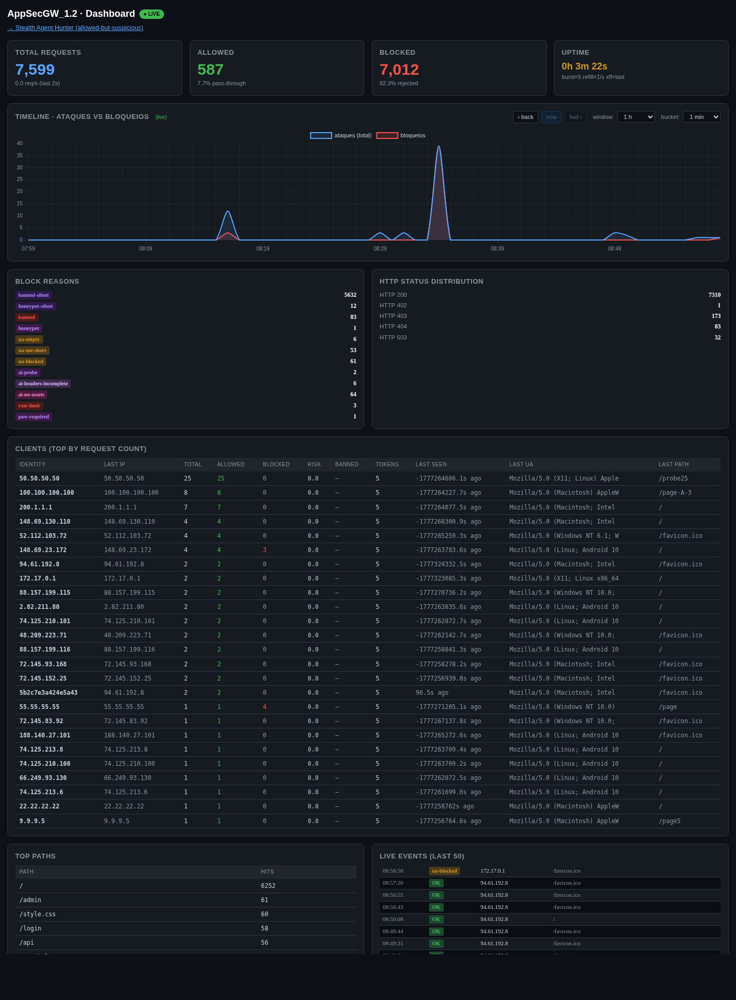
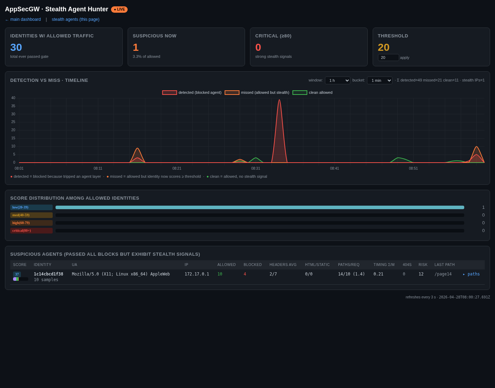

# AppSecGW — Anti-Automation Reverse Proxy

A hardened reverse HTTP/WS gateway that sits in front of any web application
and applies **13 layered detection & mitigation controls** against automated
agents (CLI tools, scrapers, headless browsers, AI agents). Domain-agnostic:
the upstream is supplied exclusively via the `UPSTREAM` environment variable.

| Property | Value |
|---|---|
| Image | `appsec-antibot-gw:1.4.5` (~ 79 MB) |
| Base | Chainguard Wolfi distroless (`cgr.dev/chainguard/python:latest`) |
| Trivy CVE findings | **0** (any severity) |
| Stack | Python 3.14 / aiohttp 3.13 / SQLite WAL |
| User | non-root, UID 65532 |
| Architecture | linux/amd64, linux/arm64 |

---

## Quick start

```bash
docker network create --driver bridge antibot-net 2>/dev/null
docker volume  create antibot-data 2>/dev/null

KEY="$(openssl rand -base64 24 | tr '+/' '-_' | tr -d '=')"
MYIP="$(curl -s https://api.ipify.org)"

docker run -d --name appsec-antibot-gw1.4.5 \
  --restart unless-stopped --init \
  --read-only --tmpfs /tmp:size=8m,mode=1777,nosuid,nodev,noexec \
  --cap-drop ALL \
  --security-opt no-new-privileges:true \
  --security-opt apparmor=docker-default \
  --pids-limit 200 --memory 256m --memory-swap 256m --cpus 1.0 \
  --ulimit nofile=4096:4096 --ulimit nproc=200:200 --ulimit core=0:0 \
  --ipc=private --network antibot-net \
  --log-opt max-size=10m --log-opt max-file=3 \
  -p 8443:8443 \
  -e UPSTREAM="https://your-internal-app.example.com" \
  -e ALLOWED_HOSTS="www.example.com" \
  -e ADMIN_ALLOWED_IPS="$MYIP,127.0.0.1" \
  -e ADMIN_KEY="$KEY" \
  -e TRUST_XFF=last \
  -v antibot-data:/data \
  appsec-antibot-gw:1.4.5 \
&& echo "ADMIN_KEY: $KEY"
```

Put TLS in front (`nginx`, `cloudflared`, `caddy` …). The proxy itself
listens HTTP-only on `:8443`.

---

## Threat model & honest posture

Earlier iterations of this gateway shipped an in-process "JS challenge" that stacked client-computed primitives — SHA-256 Proof-of-Work, browser-API probe with cross-validation, anchor-fetch proof, sub-second timing windows — to try to distinguish real browsers from scripted clients. Empirically every one of those layers was bypassable in pure Python in ~1 s. They were *bot-cost amplifiers*, not security boundaries; they have been removed.

The gateway is now fully usable without any third-party service (1.4.4). Turnstile is one of two cookie-minting modes; the other is a heuristic auto-mint that runs entirely in-process. The honest posture differs by mode:

What remains:
- **Layered heuristics** — UA filter, header-completeness scoring, behavioral timing, rate limits (per-identity + per-socket-IP), risk-score model, bot-trap forms, body-pattern matching, slowloris guard, suspicious-path patterns, AI-probe path detection, honey-link injection. These are still cost amplifiers, but they're light-weight and they don't claim to be a hard wall.
- **Cookie-bound access (V8) + Turnstile minter** — opt-in via `JS_CHALLENGE=1` *and* `TURNSTILE_SITEKEY`/`TURNSTILE_SECRET`. The chal cookie is bound to (UA + IP-tier + opaque-hashed JA4 when present). The minter accepts only a Cloudflare Turnstile success token, which is generated server-side by Cloudflare and verified against `siteverify`; nothing the attacker computes locally satisfies it. Without Turnstile keys configured, this feature is disabled and a startup banner says so.
- **JA4 telemetry** — the per-request log records the TLS handshake fingerprint observed by a trusted upstream (`JA4_HEADER`, default `CF-JA4`), so operators can drive `JA4_DENY_LIST` from real traffic rather than heuristic guesses.

The cookie is therefore **also bound to the JA4 TLS fingerprint** when one is observed (V9.2). JA4 is the one signal in the stack the client *doesn't compute* — the network observes it during the TLS handshake. A cookie issued under one handshake cannot be replayed under another, so an attacker switching TLS stacks (e.g. Python urllib → curl → Chrome impersonate) loses every cookie they just paid PoW for. To use JA4 binding the gateway must sit behind a JA4-injecting front (cloudflared injects `CF-JA4`; nginx with the JA4 module also works); operator pins the trusted source via `JA4_TRUSTED_PEERS`.

For the strongest defense, **enable Cloudflare Turnstile** — `TURNSTILE_SITEKEY` + `TURNSTILE_SECRET`. The success token is minted by Cloudflare server-side and verified against `siteverify`; nothing the attacker computes locally satisfies it.

| Threat | Heuristics only (no Turnstile) | With Turnstile |
|---|---|---|
| Bare-UA `curl`/short UA | Blocked (UA filter) | Blocked |
| Empty `Accept-*` / no `Sec-Fetch-*` | Blocked (header completeness) | Blocked |
| Honey-pot path probe | Risk-score → ban + silent decoy | Same |
| Bot-trap form fill | Risk-score → ban | Same |
| Suspicious POST body (SQLi/XSS/SSTI) | Body-pattern match → silent decoy | Same |
| Single-host scripted bypass on API | Not blocked — gate is OFF | **Blocked** — Turnstile token required to mint cookie |
| Cookie replay across handshakes | n/a | Blocked (cookie bound to UA + IP-tier + JA4 hash) |

## What it does

Each incoming request passes through 13 ordered layers. Any non-PoW block
returns **the upstream homepage as `200 OK`** (silent decoy) so an attacker
cannot enumerate which layer fired.

| # | Layer | What it catches |
|---|---|---|
| 0 | Path / method / host gating | Control bytes, disallowed methods, mismatched Host, admin-IP allowlist |
| 1 | Identity ban | Previously-banned identity → silent decoy |
| 2 | Honeypot paths | `/wp-admin`, `/.env`, `/.git/config`, IMDS, `/actuator/*`, … |
| 3 | Suspicious-path patterns | CTF flag-hunting, traversal, SQLi/XSS markers, OS file paths |
| 4 | UA filter | Empty / too-short / blocklisted (60+ entries: HTTP libs, scanners, AI agents, headless browsers) |
| 5 | AI-probe paths | OpenAPI / Swagger / `llms.txt` / model discovery |
| 6 | Header completeness | Browser UA without `Sec-Ch-Ua` / `Sec-Fetch-*` |
| 7 | Path-discipline | Enumeration (>300 unique paths), HTML loads with no asset fetches |
| 8 | Socket-IP rate limit | Token bucket on kernel-observed peer IP (un-spoofable) |
| 9 | Per-identity rate limit | Token bucket on identity hash; static-asset GETs exempt |
| 10 | Behavioural timing | σ/μ < 0.05, lag-1 autocorr > 0.85, 50ms-bin majority > 70 % |
| 11 | Proof-of-Work | Bound to `METHOD:path`, replay-protected; opt-in per path |
| 12 | Risk-score model | Weighted scoring, NAT-aware threshold |
| 13 | Honey-link injection | Hidden links injected before `</body>` to trap HTML parsers |

Plus protocol-level support:

- **WebSocket bridging** — full bidirectional bridge with sub-protocol negotiation
- **SSO redirect rewriting** — `Location`, embedded `redirect_uri`, `Set-Cookie` `Domain=`
- **Origin / Referer / Host rewriting** to upstream's canonical origin
- **Streaming body forwarding** with hard size caps
- **Edge-injected security response headers** on HTML (XFO, nosniff, HSTS, COOP, CORP, Permissions-Policy, …)

---

## Screenshots

### Main dashboard — `/__dashboard`
Real-time overview with live counters, the timeline (total / allowed / blocked), block-reason breakdown and the live event log.



### Stealth Agent Hunter — `/__agents`
Identities that passed every block but exhibit stealth signals. Per-identity stealth score 0–100 with component bars, plus the detection-vs-miss timeline.



## Operator dashboards

Reachable from any IP in `ADMIN_ALLOWED_IPS` with the admin key:

| URL | Purpose |
|---|---|
| `/__live` | Unauthenticated liveness probe (returns `ok`) |
| `/__dashboard?key=…` | Real-time metrics, timeline (total / allowed / blocked) |
| `/__agents?key=…` | **Stealth Agent Hunter** — identities that passed every block but exhibit stealth signals |
| `/__service?key=…` | **Service Metrics** — CPU / memory / disk / processes / FDs / network / SQLite size with 12 h windowed history |
| `/__service-data?key=…` | Service-metrics JSON feed (windowed) |
| `/__metrics?key=…` | JSON feed |
| `/__agents-data?key=…` | Per-identity stealth-score JSON |
| `/__agents-timeline?key=…` | Detected-vs-missed timeline JSON |
| `/__pow?key=…` | Mint a PoW challenge bound to (method, path) |
| `/__solver?key=…` | Browser-side PoW solver |
| `/__status?key=…` | Per-identity bucket state |
| `/__unban?key=…&id=… \| ip=… \| all=1` | Clear ban + risk for an identity / IP / all |

---

## Configuration (env vars)

### Required

| Variable | Description |
|---|---|
| `UPSTREAM` | Fully-qualified URL of the backend to protect. Container fails fast if missing. |

### Frequently used

| Variable | Default | Description |
|---|---|---|
| `ALLOWED_HOSTS` | _(empty)_ | Comma-separated public hostnames the gateway accepts as Host header |
| `ADMIN_ALLOWED_IPS` | _(empty)_ | Comma-separated IPs/CIDRs allowed on `/__*` |
| `ADMIN_KEY` | auto-generated | Always mirrored to `/data/.admin_key` |
| `TRUST_XFF` | `last` | `last` behind a trusted proxy / cloudflared, `none` for direct exposure |

### Rate limiting

| Variable | Default |
|---|---|
| `BURST` / `REFILL` | `30` / `2.0` (per-identity) |
| `IP_BURST` / `IP_REFILL` | `60` / `8.0` (socket-IP) |

### Method allowlist

| Variable | Default |
|---|---|
| `ALLOWED_METHODS` | `GET,HEAD,POST,OPTIONS` |

Add `PUT,PATCH,DELETE` for REST APIs.

### Proof-of-Work

| Variable | Default |
|---|---|
| `POW_REQUIRED_PATHS` | _(empty)_ |
| `POW_REQUIRE_ALL_WRITES` | `0` |

PoW is **opt-in**. Set `POW_REQUIRED_PATHS=/login,/admin` to require PoW on
those paths only.

### Security response headers

| Variable | Default |
|---|---|
| `INJECT_SECURITY_HEADERS` | `1` |
| `SEC_X_FRAME_OPTIONS` | `SAMEORIGIN` |
| `SEC_X_CONTENT_TYPE_OPTIONS` | `nosniff` |
| `SEC_REFERRER_POLICY` | `strict-origin-when-cross-origin` |
| `SEC_HSTS` | `max-age=31536000; includeSubDomains` |
| `SEC_PERMISSIONS_POLICY` | minimal whitelist |
| `SEC_COOP` | `same-origin` |
| `SEC_CORP` | `same-site` |
| `SEC_X_PERMITTED_XDP` | `none` |
| `SEC_CSP` | _(empty)_ |

### Resource caps

| Variable | Default |
|---|---|
| `UPSTREAM_MAX_BODY` | `2 MiB` |
| `UPSTREAM_MAX_RESP` | `8 MiB` |
| `MAX_IDENTITIES` | `100000` |
| `ENUM_THRESHOLD` | `300` (unique paths/identity before enum block) |

### Service-metrics sampling

| Variable | Default | Description |
|---|---|---|
| `SVC_METRICS_INTERVAL` | `5` | Seconds between samples on the service dashboard. |
| `SVC_METRICS_RETENTION` | `8640` | Number of samples kept in memory (8640 × 5 s = 12 h). |

Each sample includes: CPU %, load average (1/5/15), memory total/used/available, swap, cgroup memory, disk total/used/available for `/data`, process count, open FDs, network rx/tx bps, and SQLite file sizes (db + WAL + SHM). Dashboard supports `prev / now / fwd` navigation, window selector (5 min – 12 h), bucket selector (5 s – 1 h).

### v1.4.2/3 header-based controls (all opt-in)

| Variable | Default | Description |
|---|---|---|
| `JA4_HEADER` | `CF-JA4` | Name of the header carrying the TLS fingerprint (cloudflared injects `CF-JA4` since 2024.x) |
| `JA4_DENY_LIST` | _(empty)_ | Comma-separated TLS fingerprints to block (e.g. `t13d_curl_8x,t13d_python_requests`) |
| `JA4_TRUSTED_PEERS` | _(empty)_ | Comma-separated IPs/CIDRs allowed to inject the JA4 header (the TLS terminator). Empty = trust all (assumes firewall blocks direct port access). |
| `STRICT_ORIGIN` | `0` | When `1`, POST/PUT/PATCH/DELETE requires `Origin` header host to match `ALLOWED_HOSTS` |
| `OPEN_ORIGIN_PATHS` | _(empty)_ | Path prefixes that bypass the Origin check (e.g. `/api/webhook`) |
| `REQUIRED_HEADERS` | _(empty)_ | Comma-separated header names that must be present on every non-`/__/` non-static request |

### v1.4 controls (all opt-in / safe defaults)

| Variable | Default | Description |
|---|---|---|
| `JS_CHALLENGE` | `0` | Cookie gate. With `=1`, every non-static, non-admin, non-opted-out request must carry a valid `chal` cookie. Two minting modes: (a) **Turnstile mode** when `TURNSTILE_SITEKEY` + `TURNSTILE_SECRET` are configured — Cloudflare's `siteverify` is the boundary, only widget-solved tokens validate. (b) **Heuristic mode** when no Turnstile keys — cookie is auto-issued on the first qualifying HTML GET (one that passes UA filter, header completeness, behavioural, body-pattern, canary-echo, etc.). Heuristic mode adds ~1 RTT of cost to scripted clients and forces them through every other layer; not a hard wall, but works without any third-party dependency. Cookieless API/XHR/POST hits are always silent-decoyed in either mode. |
| `JS_CHALLENGE_TTL` | `3600` | Cookie lifetime in seconds. |
| `JS_CHAL_OPEN_PATHS` | _(empty)_ | Comma-separated path prefixes that bypass the cookie gate. Use for legit non-browser clients (S2S, mobile apps, webhooks, e.g. `/webhook/,/s2s/`). |
| `JS_CHAL_STRICT_STATIC` | `1` | When ON, the static-asset bypass refuses paths containing API hints (`/api/`, `/graphql`, `/v1/`, ...). Closes `/api/v1/users.css` style probes against permissive backends. |
| `TURNSTILE_SITEKEY` | _(empty)_ | Cloudflare Turnstile public site key. Required to enable the gate. |
| `TURNSTILE_SECRET` | _(empty)_ | Cloudflare Turnstile secret. Used by `/__challenge` to call `siteverify`. |
| `JS_CHAL_BIND_JA4` | `1` | Bind the chal cookie to the JA4 fingerprint (opaque hash, never the raw value) when one is injected by a trusted peer. Cookie replay across TLS stacks fails. Opportunistic — clients with no JA4 still work. |
| `JS_CHAL_REQUIRE_JA4` | `0` | Hard requirement: `/__challenge` rejects (`403`) any submission without a JA4 from a trusted peer. Use only behind a JA4-injecting terminator (cloudflared / nginx-JA4). |
| `CANARY_ECHO_DETECTION` | `1` | **R7 (1.4.3)** — plant unique `agw-c-<16hex>` tokens in every HTML response (HTML comment + `X-Trace-Id` header). Any subsequent request from any identity that quotes one of those tokens back is silent-decoyed and ban-pooled. Targets LLM agents that summarise the page into the model's context and re-emit fragments in the next prompt. Near-zero false-positive on browser traffic. |
| `CANARY_TTL_S` | `600` | How long an issued canary stays valid for echo detection (sliding window). |
| `HOSTILE_BAN_SECS` | `86400` | **R8 (1.4.3)** — duration to keep AI-agent-flagged identities (canary-echo, honeypot, suspicious-path, ai-probe) silent-decoyed. Generic bans still use the shorter `RISK_BAN_DURATION_SECS`. |
| `BODY_PATTERN_MATCH` | `0` | Extends the suspicious-path regex set to POST/PUT/PATCH bodies (SQLi/XSS/SSTI/cmd-injection markers in form/JSON/XML). |
| `BOT_TRAP_FORMS` | `0` | Auto-injects a hidden `<input>` into every `<form>` in HTML responses; flags POSTs that fill it. |
| `HEADERS_TIMEOUT` | `10` | Slowloris: max seconds to receive full request headers. |
| `BODY_TIMEOUT` | `30` | Slowloris: max seconds to receive full request body. |

### Session cookie

| Variable | Default |
|---|---|
| `SESSION_SAMESITE` | `Lax` |
| `SESSION_SECURE` | `1` |

### Debug

| Variable | Default |
|---|---|
| `DEBUG` | `0` (set `1` to expose `/__xff`) |

---

## Container hardening

| Control | Value |
|---|---|
| Filesystem | `--read-only` rootfs + `--tmpfs /tmp:size=8m,nosuid,nodev,noexec` |
| Capabilities | `--cap-drop ALL` |
| Privilege escalation | `--security-opt no-new-privileges:true` |
| MAC | `--security-opt apparmor=docker-default` |
| PID 1 | `--init` (tini) |
| IPC | `--ipc=private` |
| Network | dedicated user-defined bridge (`--network antibot-net`) |
| Resources | `--memory 256m --memory-swap 256m --cpus 1.0 --pids-limit 200` |
| Ulimits | `nofile=4096 nproc=200 core=0` |
| Logs | `--log-opt max-size=10m --log-opt max-file=3` |
| User | non-root UID 65532 |
| CVEs (Trivy) | **0** |

---

## Operator helpers

### `myip.sh`

Auto-detects your public IP and (re)launches the container with
`ADMIN_ALLOWED_IPS=<ip>,127.0.0.1`. Re-run when your IP changes (laptop
roaming, VPN switch, ISP rotation).

```bash
UPSTREAM=https://your-app ALLOWED_HOSTS=www.example.com ./myip.sh --apply
```

### Pull from Harbor

```bash
docker login >harbor<
docker pull  >harbor</antibotappsecgw/antibotappsecgw:1.3
```

---

## Build from source

```bash
git clone https://github.com/<your-org>/appsec-antibot-gw.git
cd appsec-antibot-gw
docker build --pull -t appsec-antibot-gw:1.4.5 .
trivy image appsec-antibot-gw:1.4.5        # expect 0 findings
```

Multi-stage build:

1. **builder** — `cgr.dev/chainguard/python:latest-dev` installs the
   wheels into an isolated `/pydeps` prefix
2. **runtime** — `cgr.dev/chainguard/python:latest` (no shell, no apt) gets
   only the application files + the wheels

---

## Files in `/data` (named volume)

| File | Purpose |
|---|---|
| `antibot.db` | SQLite WAL: events / clients / timeline / bans |
| `.admin_key` | Operator admin key (mode 0600) |
| `.session_key` | 32-byte HMAC key for signed session cookies |
| `.pow_key` | 32-byte HMAC key for PoW challenge signing |

All owned by UID 65532 (`nonroot`).

---

## Repository layout

```
.
├── proxy.py                                    main reverse proxy (single file)
├── Dockerfile                                  multi-stage Wolfi distroless build
├── docker-compose.yml                          example compose deployment
├── myip.sh                                     auto-detect-IP launcher
├── README.md                                   this file
├── manual/manual-report-1.3.html               implementation report (HTML source)
├── AppSecGW-1.3-Report.pdf                     implementation report (PDF)
├── img/
│   ├── dashboard.png                           main dashboard screenshot
│   └── agents.png                              stealth-agent hunter screenshot
├── .dockerignore
└── .trivyignore                                kept for fallback / documentation
```

---

## License

Internal — see project owner.

## Author

Pedro Tarrinho

## Version history

| Version | Highlights |
|---|---|
| 1.4.5 | **HMAC key rotation lever.** New admin endpoint `POST /__rotate-keys?key=…&scope=session\|pow\|all` regenerates `SESSION_KEY` (and optionally `POW_HMAC_KEY`) atomically and persists to `/data/.session_key` / `.pow_key`. Every chal/session cookie issued before the call fails HMAC verification immediately. Closes the pentester finding "old chal cookie still works after upgrade — HMAC secret not rotated". `JS_CHAL_OPEN_PATHS` documented as the SPA-friendly knob for data-layer prefixes (`/bin/mvc.do/,/api/,…`). Dashboards stamp `AppSecGW_1.4.5`. |
| 1.4.4 | **No third-party dependency.** Cookie gate engages with `JS_CHALLENGE=1` regardless of Turnstile — when Turnstile keys are configured the cookie is minted by Cloudflare's `siteverify` (production-grade), otherwise the cookie is auto-minted on the first qualifying HTML GET (heuristic friction layer; ~1 RTT bypass cost vs determined script). Gateway is now fully usable without any external service. **Silent-decoy status code now mirrors upstream `/`** instead of hard-coded 200 — closes the 200-with-404-page fingerprint that an agent could use to distinguish blocked vs forwarded responses. |
| 1.4.3 | **AI-canary echo detection (R7) + 24 h hostile pool (R8).** Every HTML response (challenge page included) is stamped with a unique `agw-c-<16hex>` token in an HTML comment and the `X-Trace-Id` header. Subsequent requests from any identity that quotes one of those tokens back at the gateway — in URL, header, or POST body — are silent-decoyed and the identity is added to the hostile pool for `HOSTILE_BAN_SECS` (default 24 h). Pentester-confirmed: this catches LLM-driven agents whose model context treats server-issued strings as actionable text and re-emits them in subsequent prompts. Near-zero false-positive on browser traffic. |
| 1.4.2 | **JS challenge is now Turnstile-only.** PoW + browser-API probe + anchor-fetch proof + timing window were empirically bypassable in pure Python in ~1 s/session and have been removed. The cookie gate engages only when `TURNSTILE_SITEKEY` + `TURNSTILE_SECRET` are configured; the chal cookie is then minted by Cloudflare-server-validated tokens and bound to (UA + IP-tier-hash + JA4-hash). Cross-version pentest matrix and per-iteration verdicts published in this README. |
| 1.4.1 | slowloris guard · bot-trap forms · body pattern matching · service-metrics dashboard (CPU/mem/disk/procs/FDs/net/SQLite size) · windowed time-navigation on agents + service charts · TLS / JA4 fingerprint deny-list (`JA4_TRUSTED_PEERS` for source pinning) · `STRICT_ORIGIN` enforcement on state-changing methods · `REQUIRED_HEADERS` operator-defined header presence check · dashboard HTML extracted to `dashboards/` · service-metrics samples persisted to SQLite (restart-survivable) · **V8/F1-F4** chal cookie required on every non-static path (closes API bypass via Mozilla UA) · static-suffix bypass tightened against `/api/...css` style probes (`JS_CHAL_STRICT_STATIC`) · `/__challenge` rate-limited · stealth-block precedence (host/TLS/origin checks fire before challenge gate) · chal cookie bound to socket-IP /24 (v4) or /48 (v6) tier (opaque HMAC hash, no RFC1918 leak) · XFF-aware client-IP source · chal cookie bound to JA4 TLS fingerprint hash (`JS_CHAL_BIND_JA4`) when injected by a trusted peer · per-request JA4 surfaced in event log so operators can populate `JA4_DENY_LIST` from telemetry · cookie gate exposed across V9 → R3 iterations to be a bot-cost amplifier, not a hard wall (replaced in 1.4.2) |
| 1.3 | Wolfi distroless (zero CVEs) · WebSocket bridge · SSO 302 rewriting · admin IP allowlist · edge security headers · stealth-agent hunter · streaming body fix |
| 1.2 | hardening pass · 34/34 audit findings closed · timeline + agents dashboards · PoW replay protection |
| 1.0 | initial 6-layer prototype |

## Pentest results per version

Each row is a recorded post-release pentest of the deployed image. The "honest verdict" column is what the pentester (and we) *empirically observed* — not what the marketing claimed.

| Version | Configuration | Probe / scenario | Result | Honest verdict |
|---|---|---|---|---|
| 1.0 — 1.3 | n/a | Layered heuristics only (UA filter, header completeness, behavioral, rate-limits) | Bare-bot UAs (`curl`, short UA, `python-requests`) silent-decoyed; full-Chrome scripted clients forwarded | Bot-cost amplifier — never claimed to stop a determined scripted client |
| 1.4.1 (V8) | `JS_CHALLENGE=1`, no Turnstile | `Mozilla/5.0` + `Accept: application/json` straight to `/api/v1/users` | **Forwarded — bypass works** (V8 finding) | Cookie gate only checked HTML routes; API paths sailed through on a UA substring |
| 1.4.1 (V8 fix) | same, post-fix | Same as above | Silent-decoyed | Cookie now required on every non-static path |
| 1.4.1 (V9) | `+ CHAL_PROBE_STRICT=1`, `JS_CHAL_DIFFICULTY=5` | Solve PoW in Python, build matching probe, POST `/__challenge` | **Cookie issued in ~1.2 s** (V9 finding) | PoW + probe are client-computed → fully scriptable |
| 1.4.1 (V9.1) | + opaque tier-hash | inspect cookie wire format | No `172.17.0.0` / RFC1918 leak | Earlier V9.0 had leaked the docker bridge IP |
| 1.4.1 (V9.2) | + `JS_CHAL_BIND_JA4=1` | Cookie minted under Python urllib JA4 → replayed under different JA4 | Replay silent-decoyed; same-JA4 single-stack attacker still passes after 1.2 s PoW | Handshake binding closes cross-stack replay; doesn't stop a determined single-stack attacker |
| 1.4.1 (R1) | as V9.2, direct connection (no JA4 header) | Same Python PoC | **Cookie issued in 1.16 s** | JA4 binding disengages without a JA4-injecting front |
| 1.4.1 (R2) | + `JS_CHAL_REQUIRE_ANCHOR=1` (anchor-fetch proof) | Naïve Python script (no anchor) | Rejected `anchor missing` | Naïve bypass dies |
| 1.4.1 (R2 adapted) | same | Script parses HTML, fetches anchor, then POSTs | **Cookie issued in ~1.0 s** | +1 RTT cost; bypass scriptable in 4 lines |
| 1.4.1 (R3) | + dual anchor (`` + `<script src=…&j=1>`) + 400 ms timing window | Script that fetches both anchors | **Cookie issued in ~1.4 s** | +1 more RTT; bypass scriptable in 1 more line |
| **1.4.2** | PoW + probe + anchor + timing **removed**; `JS_CHALLENGE=1` requires Turnstile keys to engage | Pure-Python `Mozilla/5.0` on `/api/...` | Forwarded (gate intentionally OFF without TS keys) | Pre-V8 layers active; honest about the gap |
| 1.4.2 (Turnstile, T1) | `TURNSTILE_SITEKEY=1x00…AA` + always-pass test secret | Empty token | 403 `missing turnstile` | Token-required check works |
| 1.4.2 (Turnstile, T1) | same | Dummy non-empty token | **Cookie issued** | Test sitekey is "always pass" by Cloudflare contract — not a finding |
| 1.4.2 (Turnstile, T1) | same | Cookie replay under a different `User-Agent` | Silent-decoyed | UA-binding works |
| 1.4.2 (Turnstile, T2) | always-fail test secret (`2x00…AA`) — mimics real-key rejection of fabricated tokens | Dummy non-empty token | **403 `turnstile rejected`** by Cloudflare `siteverify` | Bypass closed; only legitimately-solved widget tokens validate |
| 1.4.2 (Turnstile, T2) | same | Direct API without cookie | Silent-decoyed | Gate forwards nothing without a valid cookie |
| 1.4.3 (R7) | `CANARY_ECHO_DETECTION=1` (default), `+ Turnstile keys` | Pentester R5/R6 lab — built attacker C11 (110 LoC + `time.sleep(2)`) that bypasses 16 layers of pure-protocol checks | C11 still bypasses generic bot defenses; **but L7 honeypot caught their C5 and L8 canary-echo caught their C6** because LLM-driven agents follow `display:none` links and quote prior-response strings into next prompt | Built into 1.4.3 as the canary-echo detector. Targets only AI agents (low-FP); does NOT claim to stop a determined script-only attacker — that ceiling is the pure-HTTP protocol limit |
| 1.4.3 (R8) | `HOSTILE_BAN_SECS=86400` (default) | Trigger any of the AI-agent reasons (canary-echo, honeypot-silent, ai-probe, suspicious-path) | Identity is added to the hostile pool for 24 h | Generalisation of the existing risk-score ban so AI-flagged clients stay banned long enough to be uneconomic to retry |
| 1.4.4 | `JS_CHALLENGE=1`, **no Turnstile** | `GET /` from a real-Chrome client | Cookie auto-issued (`Set-Cookie: chal=...`); subsequent API calls forwarded to upstream | Heuristic-mint mode works without any third-party dependency |
| 1.4.4 | same | `GET /api/v1/items` directly without first visiting `/` (no cookie) | Silent-decoy with **upstream's actual status** (404 here, not 200) | Status-mismatch fingerprint closed |
| 1.4.4 | same | `POST /__challenge` (Turnstile path is dormant) | `503 challenge unavailable` | Challenge endpoint refuses to mint without Turnstile so it's not exploitable in heuristic mode |
| 1.4.4 | `+ TURNSTILE_SITEKEY/SECRET` | Same as 1.4.3 Turnstile mode | Cookie minted only by Cloudflare-verified token | Operator can opt-in to the Turnstile boundary; not required for the gateway to function |
| 1.4.5 | running container | `POST /__rotate-keys?key=…&scope=session` | **200** + `{"rotated":["session"], …}`; every chal/session cookie issued before the call fails verification | Closes the "HMAC secret not rotated" pentester finding |
| 1.4.5 | same | Replay an OLD chal cookie on `/api/v1/...` after rotation | Silent-decoyed (status mirrors upstream `/`) | Old cookie genuinely revoked, not just expired |
| 1.4.5 | same | Fresh `GET /` after rotation | New cookie minted; APIs accept it | System functional after rotation; legitimate browsers self-recover on next page load |
| 1.4.5 (SPA-friendly) | `JS_CHAL_OPEN_PATHS=/bin/mvc.do/,/release-management/,/entity-management/,/content/` | Single-Page-App XHRs against operator-listed prefixes | Forwarded to upstream regardless of cookie state | Operator decides which prefixes are SPA data-layer (auth-by-app) vs gated nav (auth-by-cookie); other layers (UA, body-pattern, canary echo, rate limits, hostile pool) still apply on open paths |

### Cross-version effectiveness matrix

Same attack battery executed against every locally-available image (`1.1`, `1.2`, `1.3`, `1.4` with `JS_CHALLENGE=1`, `1.4.2` without Turnstile keys, `1.4.2` with Cloudflare always-fail test keys), each container started fresh on port 8444 with a controlled local upstream that returns distinguishable markers. Verdicts:

- **forwarded** — request reached the upstream (no block)
- **silent_decoy** — gateway substituted its cached `/` decoy (200 OK, stealth block)
- **challenge_page** — gateway served the JS-challenge HTML (browser-recoverable block)
- **bad_request** — explicit 400 (control-byte / open-redirect filter)
- **rate_limited** — 429

| Attack | 1.1 | 1.2 | 1.3 | 1.4 | 1.4.2 (no TS) | 1.4.2 (TS) |
|---|---|---|---|---|---|---|
| T01 baseline: full-Chrome on `/landing` | forwarded | forwarded | forwarded | challenge_page | forwarded | challenge_page |
| T02 bare `curl/8.0` UA | silent_decoy | silent_decoy | silent_decoy | silent_decoy | silent_decoy | silent_decoy |
| T03 empty UA | silent_decoy | silent_decoy | silent_decoy | silent_decoy | silent_decoy | silent_decoy |
| T04 `python-requests` UA | silent_decoy | silent_decoy | silent_decoy | silent_decoy | silent_decoy | silent_decoy |
| T05 Mozilla UA, no `Sec-Fetch-*` (header score = 0) | silent_decoy | silent_decoy | silent_decoy | silent_decoy | silent_decoy | silent_decoy |
| T06 Mozilla on `/api/v1/users`, Accept `text/html,json` | forwarded | forwarded | forwarded | challenge_page | forwarded | challenge_page |
| T07 SQLi `UNION SELECT` in form body | silent_decoy | **forwarded** | **forwarded** | silent_decoy | silent_decoy | silent_decoy |
| T08 `<script>` XSS in JSON body | silent_decoy | **forwarded** | **forwarded** | silent_decoy | silent_decoy | silent_decoy |
| T09 honey-pot path `/.git/HEAD` | silent_decoy | silent_decoy | silent_decoy | challenge_page | silent_decoy | challenge_page |
| T10 AI-probe path `/openapi.json` | silent_decoy | silent_decoy | silent_decoy | challenge_page | silent_decoy | challenge_page |
| T11 open-redirect target `//evil.example.com/x` | silent_decoy | silent_decoy | silent_decoy | challenge_page | silent_decoy | challenge_page |
| T12 control byte: NUL in path | silent_decoy | bad_request | bad_request | bad_request | bad_request | bad_request |
| T13 honey-pot `/admin.php` | silent_decoy | silent_decoy | silent_decoy | challenge_page | silent_decoy | challenge_page |
| T14 `Mozilla/5.0 (compatible; Googlebot/2.1)` | silent_decoy | silent_decoy | silent_decoy | silent_decoy | silent_decoy | silent_decoy |
| T15 V8-sharp: API-only `Accept` on `/api/v1/...` ‡ | forwarded | forwarded | forwarded | **forwarded** | **forwarded** | silent_decoy |
| T16 browser HTML GET on `/landing` | silent_decoy | silent_decoy | silent_decoy | challenge_page | silent_decoy | challenge_page |

‡ T15 was re-tested in **fresh state** for 1.4 and 1.4.2 because risk-score accumulation from T01-T14 silent-decoyed late attacks during the in-order sweep. Fresh state is the honest verdict; the in-order matrix would show silent_decoy for these cells, masking the V8 leak.

**Control effectiveness, summarized:**

| Control | Introduced | Effective from | Notable gap |
|---|---|---|---|
| UA blocklist + length filter | 1.0 | 1.0 | None visible in test set |
| Header-completeness scoring | 1.0 | 1.0 | None visible in test set |
| Honey-pot path list | 1.0 | 1.0 | None |
| AI-probe path list | 1.0 | 1.0 | None |
| Control-byte path filter (`%00`, CR/LF) | 1.2 | 1.2 | 1.1 silent-decoyed instead of explicit `400` |
| Body-pattern matching (`BODY_PATTERN_MATCH`) | 1.4 | 1.4 | **1.2 + 1.3 forwarded SQLi/XSS payloads** — not regressed in 1.4+ |
| Cookie gate on HTML routes | 1.4 | 1.4 (HTML only) | **V8: API-only `Accept` paths slipped through** until 1.4.1 |
| Cookie gate on every non-static path | 1.4.1 | **1.4.2 (with Turnstile)** | Without Turnstile keys the gate is OFF in 1.4.2 — closes only when `TURNSTILE_*` configured |
| Turnstile minter | 1.4.2 | 1.4.2 (when configured) | Test keys are always-pass / always-fail by Cloudflare contract; production keys reject fabricated tokens |
| JA4 cookie binding | 1.4.1 | 1.4.2 (when JA4 header injected by trusted upstream) | Disengages on direct connections; only protects against cross-stack cookie replay |
